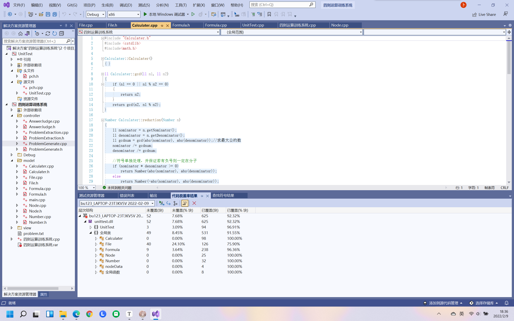

## 1. 单元测试分支覆盖率

用vs2019自带的工具运行单元测试并查看分支覆盖率，总分支覆盖率为92.32%，具体结果如下图所示。

## 2. 测试结果分析

总分支覆盖率为92.32%，说明代码的冗余度较少，测试用例覆盖范围较理想。

分析File类与Formula类分支覆盖率较低的原因如下：

1. File类未覆盖的代码集中在异常检测中。由于File类封装文件操作，因此对异常的检测较多，而文件IO异常在测试中难以模拟，因此该类的分支覆盖率较低。
2. Formula类未覆盖的代码集中在随机化生成中。由于Formula类使用随机数生成表达式的树状结构，因此实际中由于概率原因会导致部分代码不是每次都运行，因此该类的分支覆盖率较低。