# 集成测试

本项目采用自下而上的集成测试方法——集成测试从最低模块开始，逐步向应用程序的上层模块发展。这种集成一直持续到所有模块都集成在一起，整个应用程序作为一个单元进行测试。这种方法的优点是，如果在程序的最低单元存在重大故障，则更容易检测到它，并且可以采取纠正措施。

在本项目中，集成测试应用程序最里面的model部分开始，逐步向应用程序的上层模块controller部分发展，最后到最高层的view部分。如下图所示。

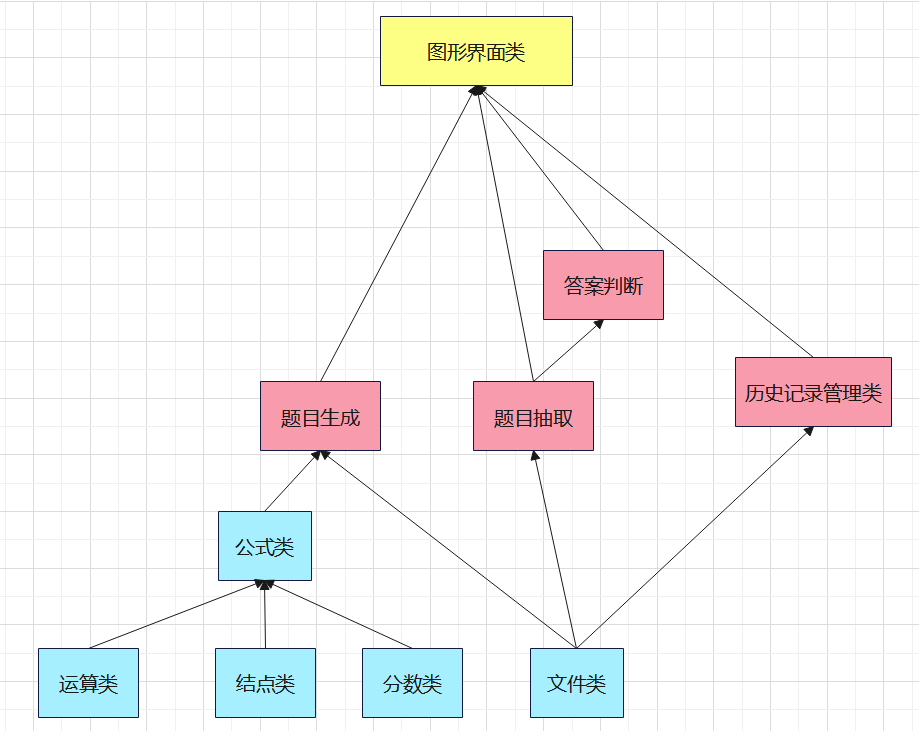

## 1 ProblemGenerate类

### 1.1 void generate() 生成1000道题目

该方法无输入，由于题目生成方式为随机生成，因此无法预先知道输出。考虑该方法结果为，将1000道题目写入文件，因此需要根据写入文件的内容判断是否合法。

| 编号 | 输出                                                 | 是否合法 |
| ---- | ---------------------------------------------------- | -------- |
| 1    | 19^1 19 1 …… 11*(3+6) 99 1                 | 是       |
| 2    | 15*(18+5) 345 1 …… 10/5 2 1                | 是       |
| 3    | 14*18 252 1 …… 19/11-7 -58 11              | 是       |
| 4    | 9*(0+12)+4 112 1 …… 9+11 20 1              | 是       |
| 5    | 6*3*17/4/10 153 20 …… 19+4+9/2 39 2        | 是       |
| 6    | 20\*2\*8/2-2+17-19 156 1 …… 2+14/2 9 1     | 是       |
| 7    | 12+19*(2-19) -311 1 …… 6-20/1/1+10+20 16 1 | 是       |
| 8    | 8+12/9+17+10 109 3 …… (18+17)*2 70 1       | 是       |
| 9    | 13*2/14/18-8 -995 126 …… 6/16 3 8          | 是       |
| 10   | 20-5+1 14 1 …… 10/7+3-13-13*10+9 913 7     | 是       |

## 2 ProblemExtraction类

### 2.1 void extract(int num=2) 抽取指定数量的题目

由于该函数随机读出指定数量的题目，因此无法根据输入判断输出内容，只能根据输出判断是否合法。

注：

* 设置的题目数量范围为1~1000的整数。
* 输出包括表达式、答案。其中题目的预期输出格式为“表达式1#表达式2#……”，答案的预期输出格式为“分子1 分母1#分子2 分母2#……”

| 编号 | 输入   | 输出                                                         | 是否合法 | 备注     |
| ---- | ------ | ------------------------------------------------------------ | -------- | -------- |
| 1    | 无输入 | 表达式：15\*12/5#3\*(16-14)# 答案：36 1#6 1#            | 是       | 缺省参数 |
| 2    | 0      | 请输入1~1000的整数！                                         | 是       | 非法输入 |
| 3    | 1.5    | 请输入1~1000的整数！                                         | 是       | 非法输入 |
| 4    | 1001   | 请输入1~1000的整数！                                         | 是       | 非法输入 |
| 5    | 2      | 表达式：15-7+19-3#5*2-19+20/14# 答案：24 1#-53 7#       | 是       |          |
| 6    | 3      | 表达式：7/10#5-16#18*1-0-13# 答案：7 10#-11 1#31 1#     | 是       |          |
| 7    | 4      | 表达式：8-3/20/17#14/20-8/15+8#16+11-12+3*12-5#19-10+9-5 5 1# 答案：2717 340#-47 6#24 1#5 1# | 是       |          |
| 8    | 5      | 表达式：3/1+13\*2#11\*17-1#12\*1#4+17\*7\*3#17/8 17 8# 答案：29 1#186 1#12 1#361 1#17 8# | 是       |          |
| 9    | 6      | 表达式：14+1#20\*2\*8/2-2+17-19#7/20#17-18*1#11/10#20+3# 答案：15 1#156 1#7 20#-1 1#11 10#23 1# | 是       |          |
| 10   | 7      | 表达式：9/19#10/1#16\*4/11#17+3/7-11#16+14/13#16/18/16#4-3# 答案：9 19#10 1#64 11#45 7#222 13#1 18#1 1# | 是       |          |

### 2.2 string getProblem(int i) 查询题目

| 序号 | 输入 | 预期输出               | 实际输出               | 是否合法 |
| ---- | ---- | ---------------------- | ---------------------- | -------- |
| 1    | -1   | 请输入0~999的数字！    | 请输入0~999的数字！    | 是       |
| 2    | 0    | 15-2+19*15             | 15-2+19*15             | 是       |
| 3    | 1    | 2/17                   | 2/17                   | 是       |
| 4    | 2    | 6^2                    | 6^2                    | 是       |
| 5    | 3    | 20-15+20               | 20-15+20               | 是       |
| 6    | 4    | 13+17*(1-6)            | 13+17*(1-6)            | 是       |
| 7    | 5    | 18*2+1                 | 18*2+1                 | 是       |
| 8    | 6    | 13-19\^1-13+19*10+10^2 | 13-19\^1-13+19*10+10^2 | 是       |
| 9    | 7    | 8^2                    | 8^2                    | 是       |
| 10   | 8    | 18*(19-2)              | 18*(19-2)              | 是       |

### 2.3 string getAnswer() 查询答案

| 序号 | 预期输出                                 | 实际输出                                 | 是否合法 |
| ---- | ---------------------------------------- | ---------------------------------------- | -------- |
| 1    | 36 1#6 1#                                | 36 1#6 1#                                | 是       |
| 2    | -6851 1#6981 280#                        | -6851 1#6981 280#                        | 是       |
| 3    | 7 10#-11 1#31 1#                         | 7 10#-11 1#31 1#                         | 是       |
| 4    | 2717 340#-47 6#-20704 1#5 1#             | 2717 340#-47 6#-20704 1#5 1#             | 是       |
| 5    | 172 1#186 1#12 1#361 1#17 8#             | 172 1#186 1#12 1#361 1#17 8#             | 是       |
| 6    | 14 1#156 1#7 20#-1 1#11 10#8000 1#       | 14 1#156 1#7 20#-1 1#11 10#8000 1#       | 是       |
| 7    | 9 19#10 1#64 11#4990 7#222 13#1 18#64 1# | 9 19#10 1#64 11#4990 7#222 13#1 18#64 1# | 是       |
| 8    | 29 1#343 1#7 10#                         | 29 1#343 1#7 10#                         | 是       |
| 9    | 20 7#28 1#                               | 20 7#28 1#                               | 是       |
| 10   | 2 1#8000 1#-339 20#25 8#9 7#12 1#        | 2 1#8000 1#-339 20#25 8#9 7#12 1#        | 是       |

### 2.4 int getNum() 查询抽取题目数量

| 序号 | 预期输出 | 实际输出 | 是否合法 |
| ---- | -------- | -------- | -------- |
| 1    | 3        | 3        | 是       |
| 2    | 4        | 4        | 是       |
| 3    | 2        | 2        | 是       |
| 4    | 5        | 5        | 是       |
| 5    | 1        | 1        | 是       |
| 6    | 2        | 2        | 是       |
| 7    | 3        | 3        | 是       |
| 8    | 2        | 2        | 是       |
| 9    | 5        | 5        | 是       |
| 10   | 7        | 7        | 是       |

## 3 AnswerJudge类

### 3.1 void readAnswer(ProblemExtraction* pe) 读取并解析答案字符串

| 序号 | 输入（pe中answers）                      | 预期输出（standardAnswer中内容）                             | 实际输出                                                     | 是否合法 |
| ---- | ---------------------------------------- | ------------------------------------------------------------ | ------------------------------------------------------------ | -------- |
| 1    | 36 1#6 1#                                | 36 1 6 1                                                | 36 1 6 1                                                | 是       |
| 2    | -6851 1#6981 280#                        | -6851 1 6981 280                                        | -6851 1 6981 280                                        | 是       |
| 3    | 7 10#-11 1#31 1#                         | 7 10 -11 1 31 1                                    | 7 10 -11 1 31 1                                    | 是       |
| 4    | 2717 340#-47 6#-20704 1#5 1#             | 2717 340 -47 6 -20704 1 5 1                   | 2717 340 -47 6 -20704 1 5 1                   | 是       |
| 5    | 172 1#186 1#12 1#361 1#17 8#             | 172 1 186 1 12 1 361 1 17 8              | 172 1 186 1 12 1 361 1 17 8              | 是       |
| 6    | 14 1#156 1#7 20#-1 1#11 10#8000 1#       | 14 1 156 1 7 20 -1 1 11 10 8000 1   | 14 1 156 1 7 20 -1 1 11 10 8000 1   | 是       |
| 7    | 9 19#10 1#64 11#4990 7#222 13#1 18#64 1# | 9 19 10 1 64 11 4990 7 222 13 1 18 64 1 | 9 19 10 1 64 11 4990 7 222 13 1 18 64 1 | 是       |
| 8    | 29 1#343 1#7 10#                         | 29 1 343 1 7 10                                    | 29 1 343 1 7 10                                    | 是       |
| 9    | 20 7#28 1#                               | 20 7 28 1                                               | 20 7 28 1                                               | 是       |
| 10   | 2 1#8000 1#-339 20#25 8#9 7#12 1#        | 2 1 8000 1 -339 20 25 8 9 7 12 1    | 2 1 8000 1 -339 20 25 8 9 7 12 1    | 是       |

### 3.2 bool judgeAnswer(Number& answer, int i) 判断用户答案对错

| 序号 | 输入（用户答案） | 标准答案 | 输出  | 是否合法 |
| ---- | ---------------- | -------- | ----- | -------- |
| 1    | 2 1              | 2 1      | true  | 是       |
| 2    | 8 1              | 8000 1   | false | 是       |
| 3    | -339 20          | -339 20  | true  | 是       |
| 4    | 25 4             | 25 8     | false | 是       |
| 5    | 22 7             | 20 7     | false | 是       |
| 6    | 343 1            | 343 1    | true  | 是       |
| 7    | 28 1             | 28 1     | true  | 是       |
| 8    | 17 10            | 11 10    | false | 是       |
| 9    | 7 20             | 7 20     | true  | 是       |
| 10   | -29 1            | 29 1     | false | 是       |

### 3.3 string getAnswer(int i) 输出答案的string格式

| 序号 | 输入 | 预期输出            | 实际输出            | 是否合法 |
| ---- | ---- | ------------------- | ------------------- | -------- |
| 1    | -1   | 请输入0~num的数字！ | 请输入0~num的数字！ | 是       |
| 2    | 0    | 12540               | 12540               | 是       |
| 3    | 1    | 65/7                | 65/7                | 是       |
| 4    | 2    | 3/8                 | 3/8                 | 是       |
| 5    | 3    | -47/6               | -47/6               | 是       |
| 6    | 4    | 16                  | 16                  | 是       |
| 7    | 5    | 28                  | 28                  | 是       |
| 8    | 6    | 272/13              | 272/13              | 是       |
| 9    | 7    | 5/3                 | 5/3                 | 是       |
| 10   | 8    | 16                  | 16                  | 是       |

## 4 ManageRecord类

### 4.1 void writeRecord(int correct, int sum) 写入历史记录

| 序号 | 输入   | 预期输出（文件写入内容）                                | 实际输出                                                | 是否合法 |
| ---- | ------ | ------------------------------------------------------- | ------------------------------------------------------- | -------- |
| 1    | -1 4   | 参数错误                                                | 参数错误                                                | 是       |
| 2    | 4 2    | 参数错误                                                | 参数错误                                                | 是       |
| 3    | 1 1001 | 参数错误                                                | 参数错误                                                | 是       |
| 4    | 1 5    | Fri Feb 11 12:53:27 2022 correct:0, wrong:3, sum:3. | Fri Feb 11 12:53:27 2022 correct:0, wrong:3, sum:3. | 是       |
| 5    | 2 2    | Fri Feb 11 12:56:35 2022 correct:0, wrong:3, sum:3. | Fri Feb 11 12:56:35 2022 correct:0, wrong:3, sum:3. | 是       |
| 6    | 5 6    | Fri Feb 11 12:58:26 2022 correct:0, wrong:2, sum:2. | Fri Feb 11 12:58:26 2022 correct:0, wrong:2, sum:2. | 是       |
| 7    | 1 5    | Fri Feb 11 12:58:32 2022 correct:0, wrong:5, sum:5. | Fri Feb 11 12:58:32 2022 correct:0, wrong:5, sum:5. | 是       |
| 8    | 2 3    | Fri Feb 11 13:02:53 2022 correct:0, wrong:5, sum:5. | Fri Feb 11 13:02:53 2022 correct:0, wrong:5, sum:5. | 是       |
| 9    | 5 8    | Fri Feb 11 13:03:17 2022 correct:0, wrong:3, sum:3. | Fri Feb 11 13:03:17 2022 correct:0, wrong:3, sum:3. | 是       |
| 10   | 3 6    | Fri Feb 11 13:16:36 2022 correct:0, wrong:1, sum:1. | Fri Feb 11 13:16:36 2022 correct:0, wrong:1, sum:1. | 是       |

### 4.2 void readRecord() 读出历史记录

| 序号 | 预期输出（文件内容）                                         | 实际输出（私有变量record[]内容）                             | 是否合法 |
| ---- | ------------------------------------------------------------ | ------------------------------------------------------------ | -------- |
| 1    | Fri Feb 11 12:53:27 2022 correct:0, wrong:3, sum:3.      | Fri Feb 11 12:53:27 2022 correct:0, wrong:3, sum:3.          | 是       |
| 2    | Fri Feb 11 12:56:35 2022 correct:0, wrong:3, sum:3.      | Fri Feb 11 12:56:35 2022 correct:0, wrong:3, sum:3.          | 是       |
| 3    | Fri Feb 11 12:58:26 2022 correct:0, wrong:2, sum:2.      | Fri Feb 11 12:58:26 2022 correct:0, wrong:2, sum:2.          | 是       |
| 4    | Fri Feb 11 12:58:32 2022 correct:0, wrong:5, sum:5.      | Fri Feb 11 12:58:32 2022 correct:0, wrong:5, sum:5.          | 是       |
| 5    | Fri Feb 11 13:02:53 2022 correct:0, wrong:5, sum:5.      | Fri Feb 11 13:02:53 2022 correct:0, wrong:5, sum:5.          | 是       |
| 6    | Fri Feb 11 17:44:40 2022 correct:0, wrong:1, sum:1. Fri Feb 11 17:44:40 2022 correct:1, wrong:1, sum:2. | Fri Feb 11 17:44:40 2022 correct:0, wrong:1, sum:1. Fri Feb 11 17:44:40 2022 correct:1, wrong:1, sum:2. | 是       |
| 7    | Fri Feb 11 17:44:40 2022 correct:2, wrong:1, sum:3. Fri Feb 11 17:44:40 2022 correct:3, wrong:1, sum:4. | Fri Feb 11 17:44:40 2022 correct:2, wrong:1, sum:3. Fri Feb 11 17:44:40 2022 correct:3, wrong:1, sum:4. | 是       |
| 8    | Fri Feb 11 17:44:40 2022 correct:4, wrong:1, sum:5. Fri Feb 11 17:44:40 2022 correct:5, wrong:1, sum:6. | Fri Feb 11 17:44:40 2022 correct:4, wrong:1, sum:5. Fri Feb 11 17:44:40 2022 correct:5, wrong:1, sum:6. | 是       |
| 9    | Fri Feb 11 17:44:40 2022 correct:0, wrong:1, sum:1. Fri Feb 11 17:44:40 2022 correct:1, wrong:1, sum:2. Fri Feb 11 17:44:40 2022 correct:2, wrong:1, sum:3. | Fri Feb 11 17:44:40 2022 correct:0, wrong:1, sum:1. Fri Feb 11 17:44:40 2022 correct:1, wrong:1, sum:2. Fri Feb 11 17:44:40 2022 correct:2, wrong:1, sum:3. | 是       |
| 10   | Fri Feb 11 17:44:40 2022 correct:3, wrong:1, sum:4. Fri Feb 11 17:44:40 2022 correct:4, wrong:1, sum:5. Fri Feb 11 17:44:40 2022 correct:5, wrong:1, sum:6. | Fri Feb 11 17:44:40 2022 correct:3, wrong:1, sum:4. Fri Feb 11 17:44:40 2022 correct:4, wrong:1, sum:5. Fri Feb 11 17:44:40 2022 correct:5, wrong:1, sum:6. | 是       |

### 4.3 string getRecord(int i) 查询记录

历史记录数为10。

| 序号 | 输入 | 预期输出                                            | 实际输出                                             | 是否合法 |
| ---- | ---- | --------------------------------------------------- | ---------------------------------------------------- | -------- |
| 1    | -1   | 请输入0~9的整数！                                   | 请输入0~9的整数！                                    | 是       |
| 2    | 10   | 请输入0~9的整数！                                   | 请输入0~9的整数！                                    | 是       |
| 3    | 0    | Fri Feb 11 16:56:23 2022 correct:0, wrong:1, sum:1. | Fri Feb 11 16:56:23 2022 correct:0, wrong:1, sum:1.  | 是       |
| 4    | 1    | Fri Feb 11 12:53:27 2022 correct:0, wrong:3, sum:3. | Fri Feb 11 12:53:27 2022 correct:0, wrong:3, sum:3.  | 是       |
| 5    | 2    | Fri Feb 11 12:56:35 2022 correct:0, wrong:3, sum:3. | Fri Feb 11 12:56:35 2022 correct:0, wrong:3, sum:3.  | 是       |
| 6    | 3    | Fri Feb 11 12:58:26 2022 correct:0, wrong:2, sum:2. | Fri Feb 11 12:58:26 2022 correct:0, wrong:2, sum:2.  | 是       |
| 7    | 4    | Fri Feb 11 12:58:32 2022 correct:0, wrong:5, sum:5. | Fri Feb 11 12:58:32 2022 correct:0, wrong:5, sum:5.  | 是       |
| 8    | 5    | Fri Feb 11 13:02:53 2022 correct:0, wrong:5, sum:5. | Fri Feb 11 13:02:53 2022 correct:0, wrong:5, sum:5.  | 是       |
| 9    | 6    | Fri Feb 11 13:03:17 2022 correct:0, wrong:3, sum:3. | Fri Feb 11 13:03:17 2022 correct:0, wrong:3, sum:3.  | 是       |
| 10   | 7    | Fri Feb 11 13:16:36 2022 correct:0, wrong:1, sum:1. | Fri Feb 11 13:16:36 2022< correct:0, wrong:1, sum:1. | 是       |

### 4.4 int getNum() 查询保存的历史记录总数

| 序号 | 预期输出 | 实际输出 | 是否合法 |
| ---- | -------- | -------- | -------- |
| 1    | 1        | 1        | 是       |
| 2    | 2        | 2        | 是       |
| 3    | 3        | 3        | 是       |
| 4    | 4        | 4        | 是       |
| 5    | 5        | 5        | 是       |
| 6    | 6        | 6        | 是       |
| 7    | 7        | 7        | 是       |
| 8    | 8        | 8        | 是       |
| 9    | 9        | 9        | 是       |
| 10   | 10       | 10       | 是       |

## 5 cmd类

### 5.1 int parse(string cmd) 命令行解析函数

| 序号 | 输入     | 预期输出 | 实际输出 | 是否合法 |
| ---- | -------- | -------- | -------- | -------- |
| 1    | -g       | 0        | 0        | 是       |
| 2    | -e 5     | 0        | 0        | 是       |
| 3    | -e -1    | 2        | 2        | 是       |
| 4    | -s       | 0        | 0        | 是       |
| 5    | -s 3     | 4        | 4        | 是       |
| 6    | -q       | -1       | -1       | 是       |
| 7    | -t       | 4        | 4        | 是       |
| 8    | -g -e -t | 4        | 4        | 是       |
| 9    | --s      | 4        | 4        | 是       |
| 10   | q        | 4        | 4        | 是       |

### 5.2 int func(int argc, string* argv) 命令行执行函数

| 序号 | 输入               | 预期输出 | 实际输出 | 是否合法 |
| ---- | ------------------ | -------- | -------- | -------- |
| 1    | -g                 | 0        | 0        | 是       |
| 2    | -e 5          | 0        | 0        | 是       |
| 3    | -e -1         | 2        | 2        | 是       |
| 4    | -s                 | 0        | 0        | 是       |
| 5    | -s 3          | 4        | 4        | 是       |
| 6    | -q                 | -1       | -1       | 是       |
| 7    | -t                 | 4        | 4        | 是       |
| 8    | -g -e -t | 4        | 4        | 是       |
| 9    | --s                | 4        | 4        | 是       |
| 10   | q                  | 4        | 4        | 是       |

### 5.3 int problemGenerate() 调用ProblemGenerate类生成题目

| 序号 | 输入（运行状态） | 预期输出 | 实际输出 | 是否合法 |
| ---- | ---------------- | -------- | -------- | -------- |
| 1    | 运行正常         | 0        | 0        | 是       |
| 2    | 运行异常         | 1        | 1        | 是       |

### 5.4 int problemExtraction(int num) 调用ProblemExtraction类抽取题目

| 序号 | 输入（运行状态） | 预期输出 | 实际输出 | 是否合法 |
| ---- | ---------------- | -------- | -------- | -------- |
| 1    | 运行正常         | 0        | 0        | 是       |
| 2    | 运行异常         | 2        | 2        | 是       |

### 5.5 int answer() 与用户交互答题

| 序号 | 输入（运行状态） | 预期输出 | 实际输出 | 是否合法 |
| ---- | ---------------- | -------- | -------- | -------- |
| 1    | 运行正常         | 0        | 0        | 是       |
| 2    | 运行异常         | 3        | 3        | 是       |

### 5.6 bool answerJudge(int num, string answer) 调用AnswerJudge类判断用户答案

| 序号 | 输入（用户答案） | 标准答案 | 输出  | 是否合法 |
| ---- | ---------------- | -------- | ----- | -------- |
| 1    | 2 1              | 2 1      | true  | 是       |
| 2    | 8 1              | 8000 1   | false | 是       |
| 3    | -339 20          | -339 20  | true  | 是       |
| 4    | 25 4             | 25 8     | false | 是       |
| 5    | 22 7             | 20 7     | false | 是       |
| 6    | 343 1            | 343 1    | true  | 是       |
| 7    | 28 1             | 28 1     | true  | 是       |
| 8    | 17 10            | 11 10    | false | 是       |
| 9    | 7 20             | 7 20     | true  | 是       |
| 10   | -29 1            | 29 1     | false | 是       |

## 6 MainWindow类

由于该类是图形界面，因此需要同时关注图形界面的显示和数据的输入输出。

### 6.1 乘方运算的选择

界面如图。

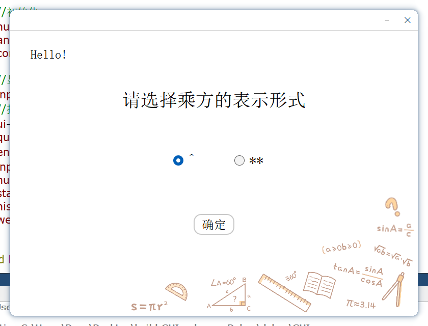

| 测试用例 | 按钮选择 | 预期输出 | 实际输出 | 是否合法 |
| -------- | -------- | -------- | -------- | -------- |
| 1        | 左边     | 选择^    | 选择^    | 是       |
| 2        | 右边     | 选择**   | 选择**   | 是       |

### 6.2 主界面显示

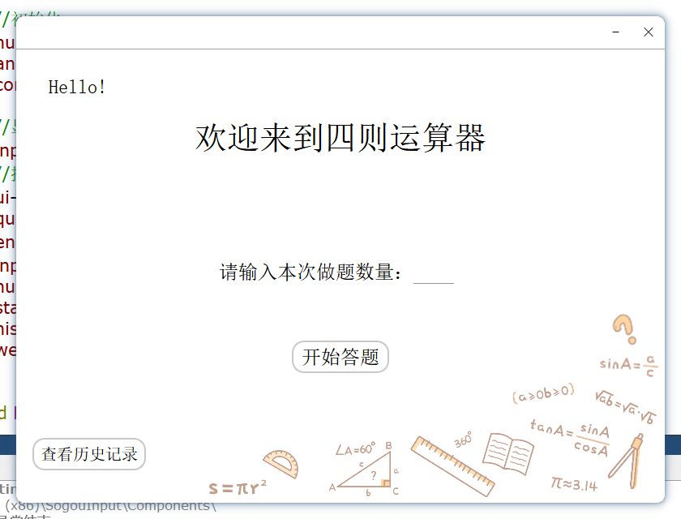

### 6.3 输入做题数量

合法时：进入第一题界面（见6.4节）

非法时：显示如下图。

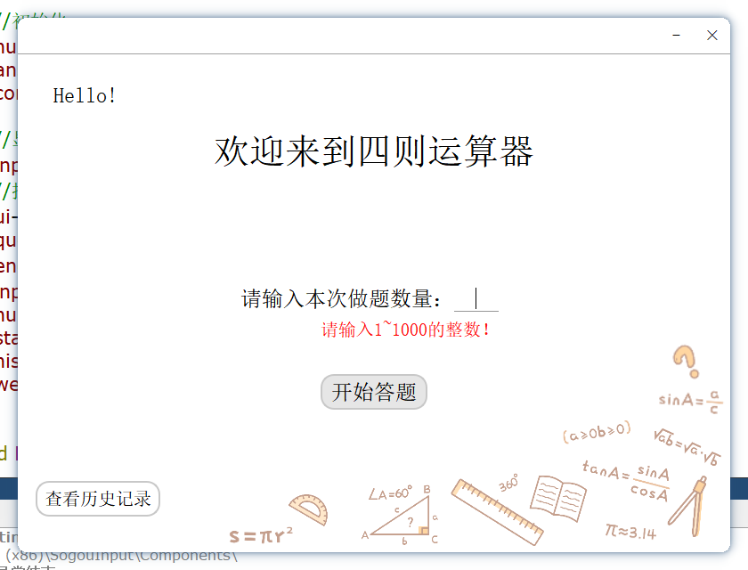

### 6.4 答题界面

“开始答题”槽函数——第一题答题界面。

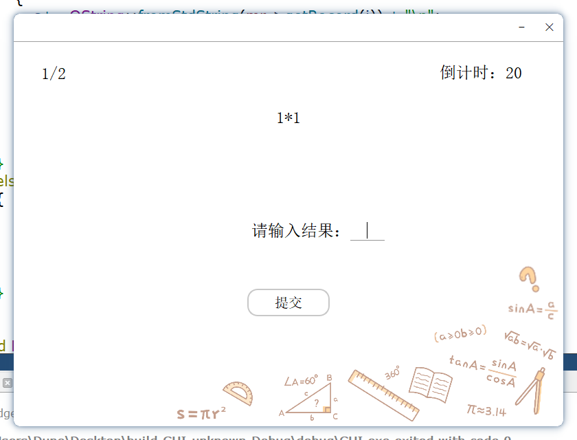

“下一题”槽函数——下一题答题界面。

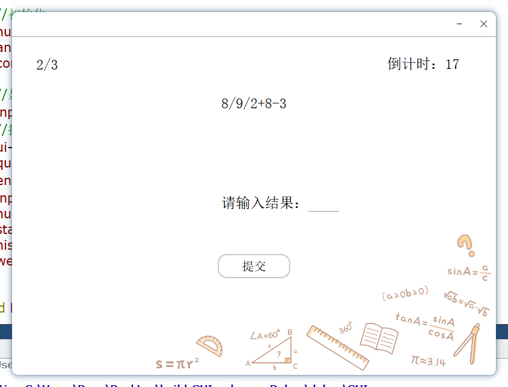

若未回答直接点击提交，显示如下。

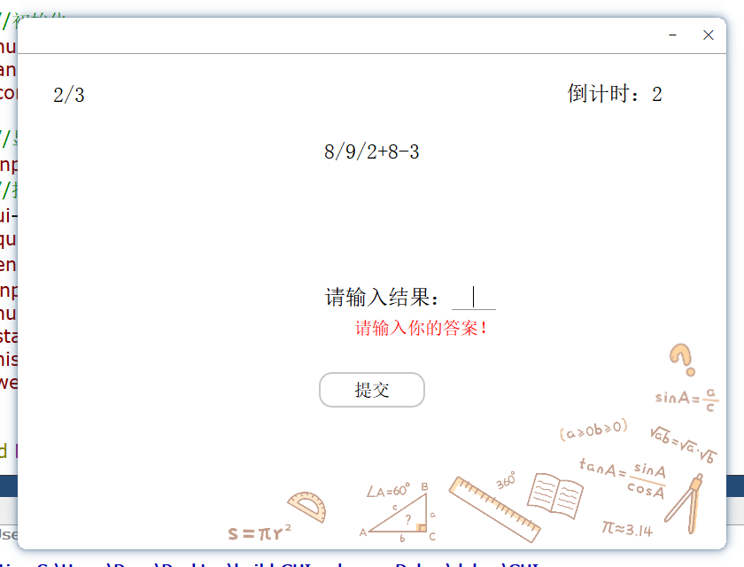

### 6.5 显示答案界面

回答正确时

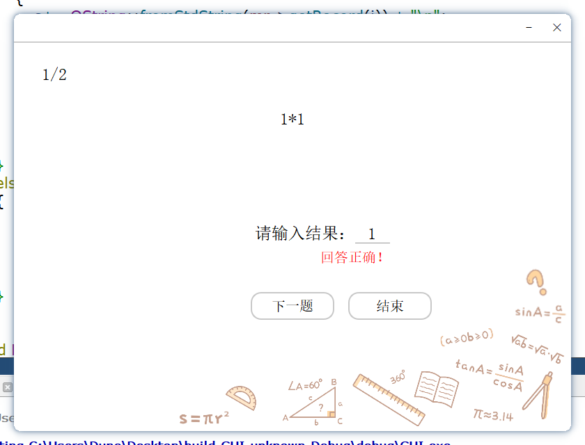

回答错误时

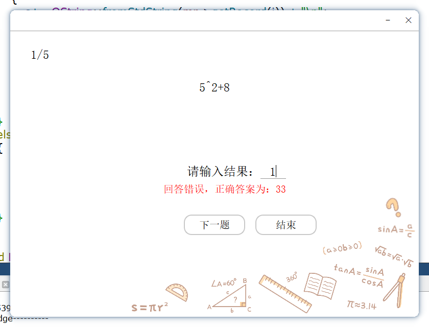

超时未回答时显示（输入框无内容，算作回答错误）

最后一题回答完后显示（无“下一题”按钮）

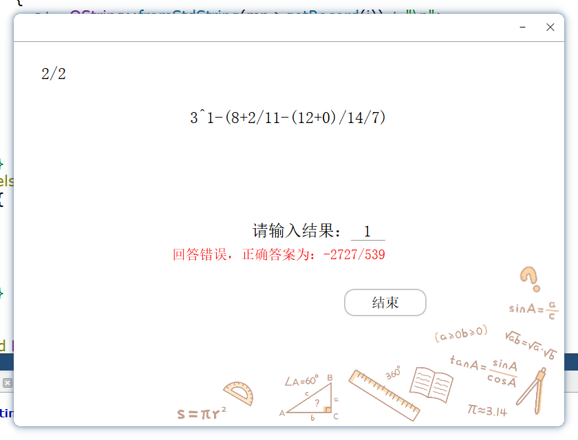

### 6.6 结束界面

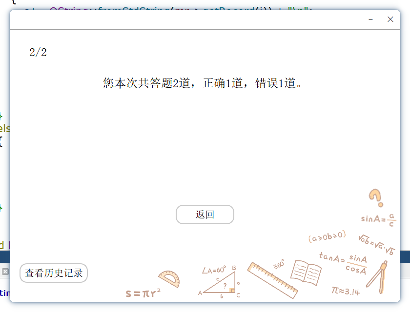

### 6.7 查看历史记录

查看历史记录

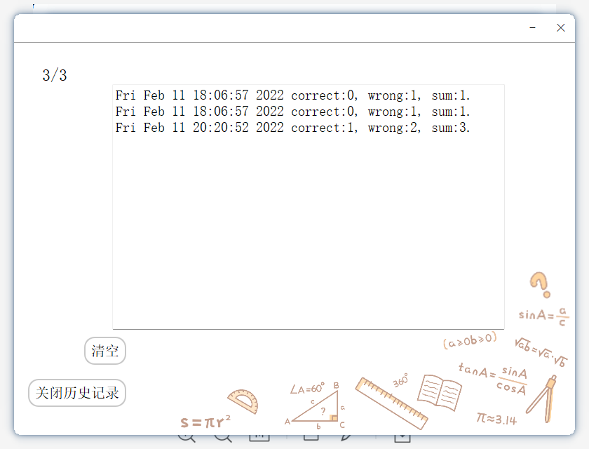

清空历史记录后

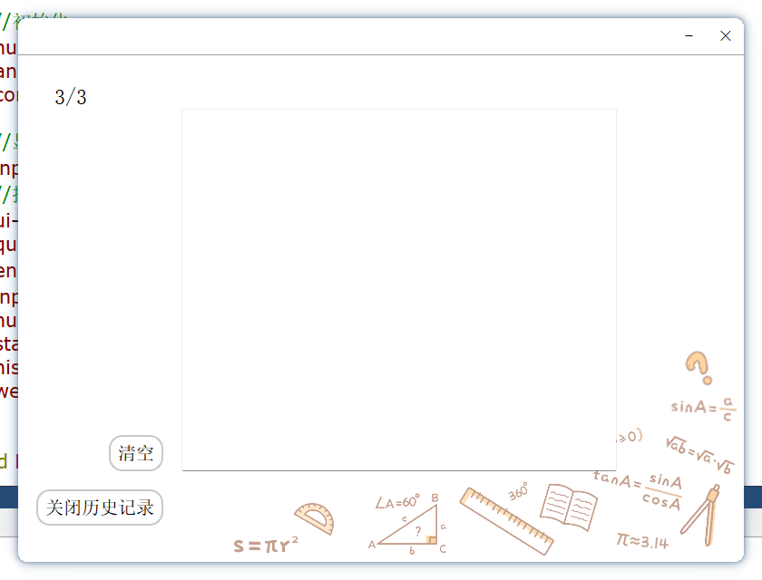
