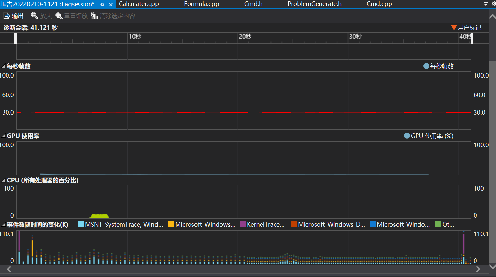
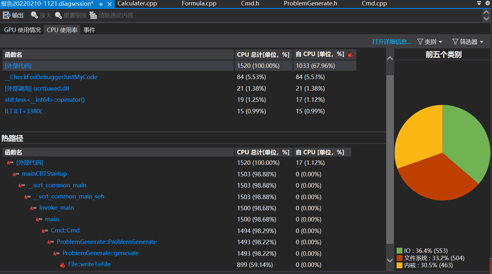
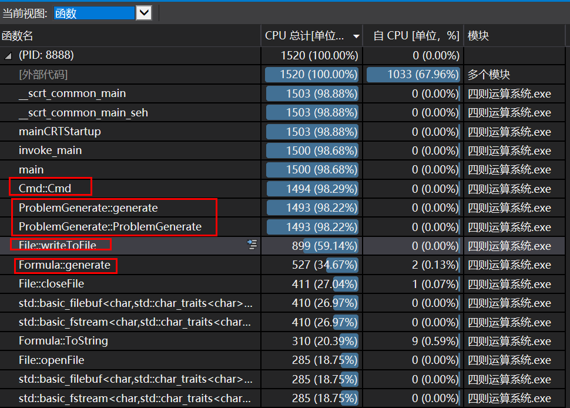
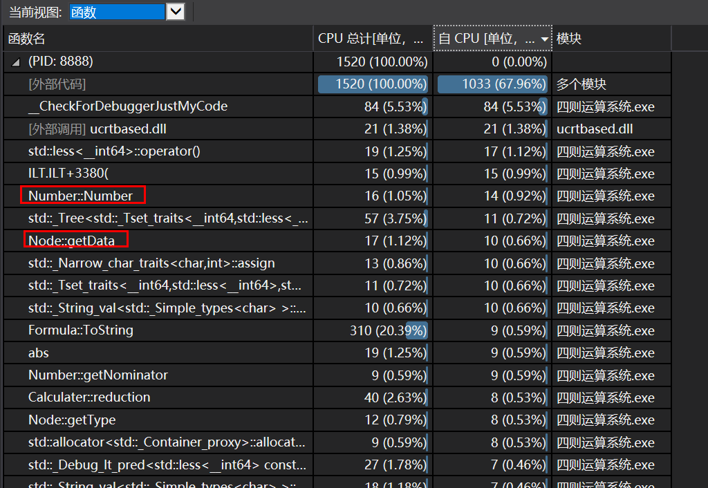
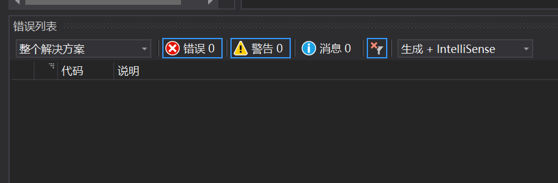

# 代码分析

本项目使用vs2019自带的代码分析工具进行代码质量和性能分析。

## 1 代码分析概述

运行程序，一次运行完毕后查看代码分析报告，如下图所示。

可以看到，在最开始CPU占用率和事件数较多。

## 2 详细信息及分析

打开并查看详细信息界面。

### 2.1 按照CPU总计排序

CPU总计是指包含该函数调用的其他函数所用的CPU占用总计情况。下图中标出了在我们编写的代码中使用CPU较多的函数。

​	可以看出，占比最高的是代码生成类中的题目生成方法和Cmd类。这是因为代码生成类需要生成1000道不重复的题目，需要调用model中的类；而Cmd类需要调用代码生成类。

​	其次是File类的写方法。

​	最后是model中的公式类，因为它用于生成单个表达式并进行求值。

### 2.2 按照自CPU排序

自CPU是指不包含该函数调用的其他函数，而只算当前函数所用的CPU情况。下图中标出了在我们编写的代码中使用CPU较多的函数。

​	可以看出，只计算当前函数时使用CPU最多的是分数类的构造函数，这是因为需要判断输入的数是否合法。

​	其次是获得结点内容的函数，这是因为该函数返回的是复合类型union类型。

### 2.3 警告消除

按照vs所给提示消除所有警告，包括所有类型转换等。

