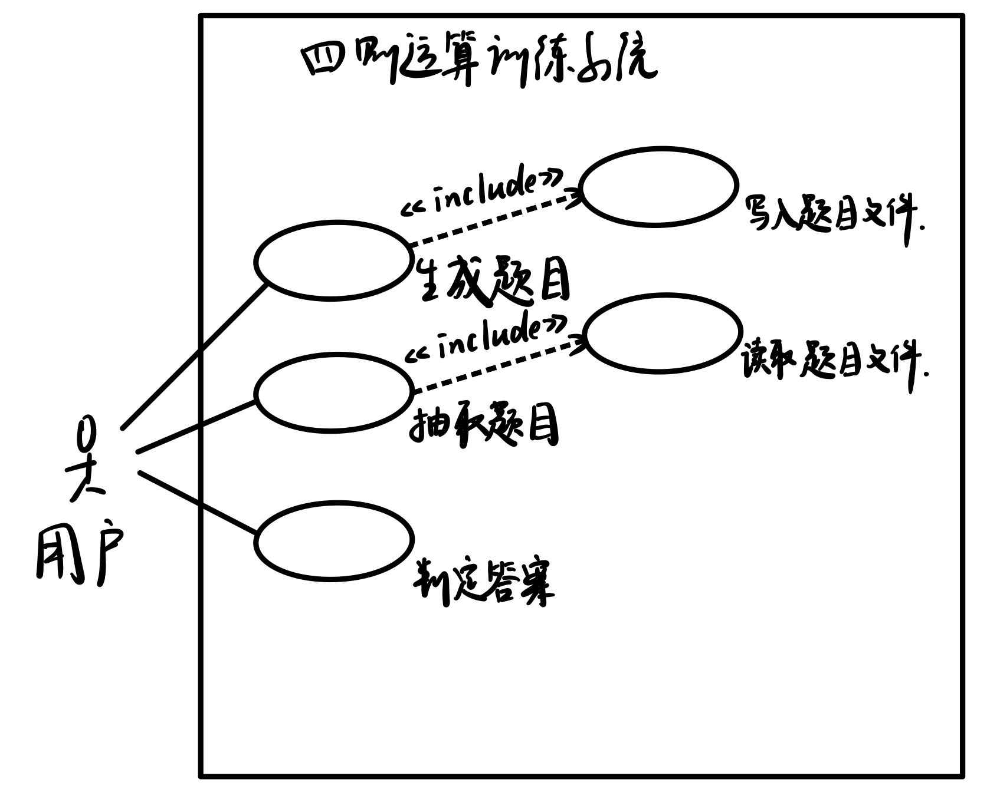

## 1. 问题陈述

四则运算训练系统，可以为用户生成四则运算题目，接受用户答案，并判断对错，返回对错总数。系统功能要求如下：

- 生成1000道不重复的四则运算题目并写入文件。要求任意两道题目不能通过有限次交换+和×左右的算术表达式变为同一道题目。
- 实现表达式求值功能，要求支持加、减、乘、除和括号运算。
- 支持真分数四则运算。
- 接收用户输入的答案，并判断对错。最后给出总共 对/错 数量。

## 2. 建立功能模型

### 2.1 识别参与者

从系统使用的角度来看，允许用户点击按钮生成1000道题目，抽取指定数量的题目，回答题目，获得答案对错及对错总数。除此之外，本系统没有其他参与者，因此参与者仅包括“用户”一类。

### 2.2 识别用例

| 参与者 | 用例     | 功能描述                                                   |
| ------ | -------- | ---------------------------------------------------------- |
| 用户   | 生成题目 | 生成1000道不重复的四则运算题目，并存储在文件中             |
| 用户   | 抽取题目 | 抽取指定数量的四则运算题目                                 |
| 用户   | 判定答案 | 用户提交自己的答案，系统对用户答案判断对错，并显示对错总数 |

### 2.3 识别用例间关系

## 3. 用例描述文档

| 用例名称：生成题目                                           |
| ------------------------------------------------------------ |
| 用例编号：1                                                  |
| 简单描述：生成1000道不重复的四则运算题目                     |
| 参与者：用户                                                 |
| 主数据流： 1. 用户进入本系统 2. 系统自动调用生成题目或用户手动调用生成题目 3. 将生成的题目（表达式和答案）写入题目文件 |
| 附加流： 1. 题目生成失败时提醒用户失败原因，并询问是否重新生成 |
| 前置条件：用户打开本系统或用户点击“题目生成”按钮             |
| 后置条件：提示题目生成成功                                   |

| 用例名称：抽取题目                                           |
| ------------------------------------------------------------ |
| 用例编号：2                                                  |
| 简单描述：抽取指定数量的题目（表达式与答案）                 |
| 参与者：用户                                                 |
| 主数据流： 1. 用户进入本系统 2. 用户输入抽取题目的数量，点击“抽取题目”按钮 3. 读取题目文件，随机读出指定数量的题目 4. 显示题目 |
| 附加流： 1. 用户输入的题目数量不是1~1000的整数，提醒用户重新输入 2. 题目文件丢失，提醒用户重新生成题目 |
| 前置条件：用户点击“抽取题目”按钮                             |
| 后置条件：提示题目抽取成功                                   |

| 用例名称：判定答案                                           |
| ------------------------------------------------------------ |
| 用例编号：3                                                  |
| 简单描述：判断用户答案是否正确，并显示对错总数               |
| 参与者：用户                                                 |
| 主数据流：用户点击“提交”按钮提交答案->系统检查用户答案，显示每题的对错情况，以及对错总数 |
| 附加流：无                                                   |
| 前置条件：用户点击“提交”按钮                                 |
| 后置条件：提示判定完成                                       |

