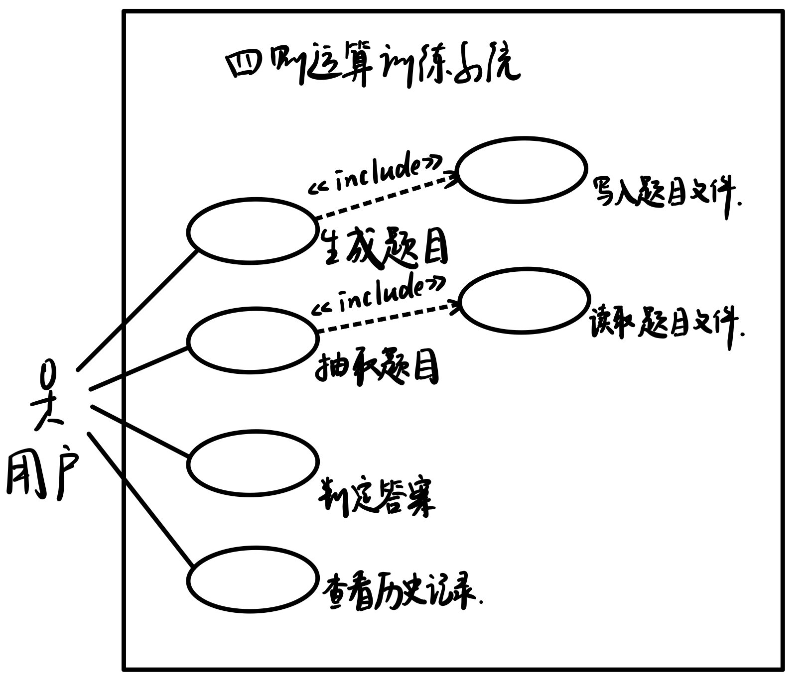

## 1. 问题陈述

四则运算训练系统，可以为用户生成四则运算题目，接受用户答案，判断对错，返回对错总数，用户可查看历史答题记录。系统功能要求如下：

- 生成1000道不重复的四则运算题目并写入文件。要求任意两道题目不能通过有限次交换+和×左右的算术表达式变为同一道题目。
- 实现表达式求值功能，要求支持加、减、乘、除、乘方和括号运算。其中乘方运算要求支持“^”和“**”两种格式。
- 支持真分数四则运算。
- 接收用户输入的答案，并判断对错。最后给出总共 对/错 数量。
- 系统可通过命令行参数的形式指定功能。
- 用windows用户图形界面实现上述功能。
- 图形界面具有倒计时功能，每个题目必须在 20 秒钟完成，如果完不成，则得0分并进入下一题。
- 图形界面具有历史记录查看功能，把用户做题的成绩记录下来并可以展现历史记录。

## 2. 建立功能模型

### 2.1 识别参与者

从系统使用的角度来看，允许用户点击按钮生成1000道题目，抽取指定数量的题目，回答题目，获得答案对错及对错总数，查看历史记录。除此之外，本系统没有其他参与者，因此参与者仅包括“用户”一类。

### 2.2 识别用例

| 参与者 | 用例         | 功能描述                                                   |
| ------ | ------------ | ---------------------------------------------------------- |
| 用户   | 生成题目     | 生成1000道不重复的四则运算题目，并存储在文件中             |
| 用户   | 抽取题目     | 抽取指定数量的四则运算题目                                 |
| 用户   | 判定答案     | 用户提交自己的答案，系统对用户答案判断对错，并显示对错总数 |
| 用户   | 查看历史记录 | 用户在答题前后可以查看历史记录                             |

### 2.3 识别用例间关系

## 3. 用例描述文档

| 用例名称：生成题目                                           |
| ------------------------------------------------------------ |
| 用例编号：1                                                  |
| 简单描述：生成1000道不重复的四则运算题目                     |
| 参与者：用户                                                 |
| 主数据流： 1. 用户进入本系统，选择乘方的表示方式 2. 系统自动调用生成题目或用户手动调用生成题目 3. 将生成的题目（表达式和答案）写入题目文件 |
| 附加流： 1. 题目生成失败时提醒用户失败原因，并询问是否重新生成 |
| 前置条件：用户打开本系统或用户点击“题目生成”按钮             |
| 后置条件：提示题目生成成功                                   |

| 用例名称：抽取题目                                           |
| ------------------------------------------------------------ |
| 用例编号：2                                                  |
| 简单描述：抽取指定数量的题目（表达式与答案）                 |
| 参与者：用户                                                 |
| 主数据流： 1. 用户进入本系统 2. 用户输入抽取题目的数量，点击“抽取题目”按钮 3. 读取题目文件，随机读出指定数量的题目 4. 显示题目 |
| 附加流： 1. 用户输入的题目数量不是1~1000的整数，提醒用户重新输入 2. 题目文件丢失，提醒用户重新生成题目 |
| 前置条件：用户点击“抽取题目”按钮                             |
| 后置条件：提示题目抽取成功                                   |

| 用例名称：判定答案                                           |
| ------------------------------------------------------------ |
| 用例编号：3                                                  |
| 简单描述：判断用户答案是否正确，显示对错总数                 |
| 参与者：用户                                                 |
| 主数据流： 1. 用户点击“提交”按钮提交答案或倒计时结束自动提交 2. 系统检查用户答案，显示每题的对错情况 3. 答题结束后，显示对错总数 |
| 附加流： 1. 用户未输入答案就点击提交时，提醒用户未提交答案 2. 倒计时结束是用户未提交答案，系统自动提交 |
| 前置条件：用户点击或倒计时结束自动触发“提交”按钮             |
| 后置条件：提示判定完成                                       |

| 用例名称：查看历史记录                                       |
| ------------------------------------------------------------ |
| 用例编号：4                                                  |
| 简单描述：显示答题历史记录，包括答题时间和答题 对/错 数量统计 |
| 参与者：用户                                                 |
| 主数据流： 1. 用户点击“查看历史记录”按钮 2. 系统读取历史记录文件，显示用户历史记录 |
| 附加流：无                                                   |
| 前置条件：用户点击“查看历史记录”按钮                         |
| 后置条件：无                                                 |
