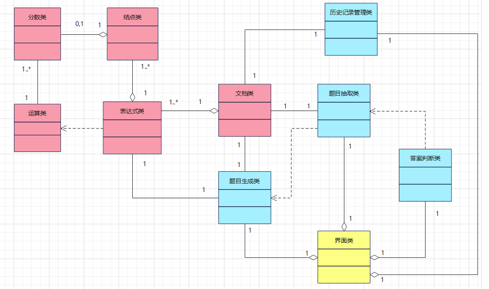

# 类图文档

## 1.图形文档

## 2.文字说明

### 2.1 类图综述

​	该类图搭建了四则运算训练器系统的model部分、controller部分和view部分。

​	model部分(红色)定义了运算数、表达式的数据结构、运算操作及运算结果，由分数类、结点类、表达式类、运算类、文档类组成。

​	controller部分(蓝色)对model部分进行实例化，并实现了题目生成、抽取和对错判断等功能。

​	view部分(黄色)通过控制controller部分负责与用户交互。

### 2.2 类描述

| 类             | 描述                                                    | 属性                                       | 方法                                                       |
| -------------- | ------------------------------------------------------- | ------------------------------------------ | ---------------------------------------------------------- |
| 分数类         | 所有运算数都可以写为一个分数，其中整数看作分母为1的分数 | 分子、分母                                 | 获得分子分母、设置分子分母                                 |
| 节点类         | 运算数结点和运算符结点                                  | 结点类型、数据、结点左孩子指针和右孩子指针 | 获取结点类型和内容、获取指针、设置结点内容                 |
| 表达式类       | 表达式的数据结构                                        | 中缀表达式、二叉树表示、值、hash值         | 生成表达式二叉树、二叉树转中缀、生成hash值、获取中缀表达式 |
| 运算类         | 分数类的四则运算实现方法及约分方法                      | 无                                         | 加、减、乘、除、乘方、约分                                 |
| 文档类         | 表达式存储及文档操作                                    | 文档路径、指针                             | 打开、关闭、清空、随机获取题目、写入、读取和展示历史记录   |
| 题目生成类     | 随机生成1000道互不相同的题目                            | 用到的文档                                 | 生成题目                                                   |
| 题目抽取类     | 在题目库中抽取一定数量的题目                            | 用到的文档、抽取数量、抽取出的题目和答案   | 抽取题目、读出抽取的数量题目和答案                         |
| 答案判断类     | 判断用户答案是否正确                                    | 题目数量、读取的答案                       | 读取答案、判断答案                                         |
| 历史记录管理类 | 管理历史记录，包括历史记录的写入、读取、清空操作        | 用到的文档、读取的记录、记录数量           | 写入记录、读取记录、查询记录、查询记录数量、清空记录文件   |
| 界面类         | 与用户进行交互                                          | 各种控件                                   | 各种槽函数                                                 |

### 2.3 关联描述

分数类和运算类之间，表达式类和题目生成类之间，文档类和题目生成类，文档类与历史记录管理类之间是普通关联。

分数类和结点类之间，结点类和表达式类之间，表达式类和文档类之间，controller所有类和界面类之间是复合聚合关联，前者消失后者也将不复存在。

关联重数见类图。

### 2.4 泛化描述

无泛化关联

### 2.5 依赖描述

运算类和表达式类之间：表达式一定需要运算类来计算答案。

题目生成类和题目抽取类之间：题目抽取需要在题目生成后才能实现其功能。

题目抽取类和答案判断类之间：答案判断需要在题目抽取实现后才能实现其功能。

