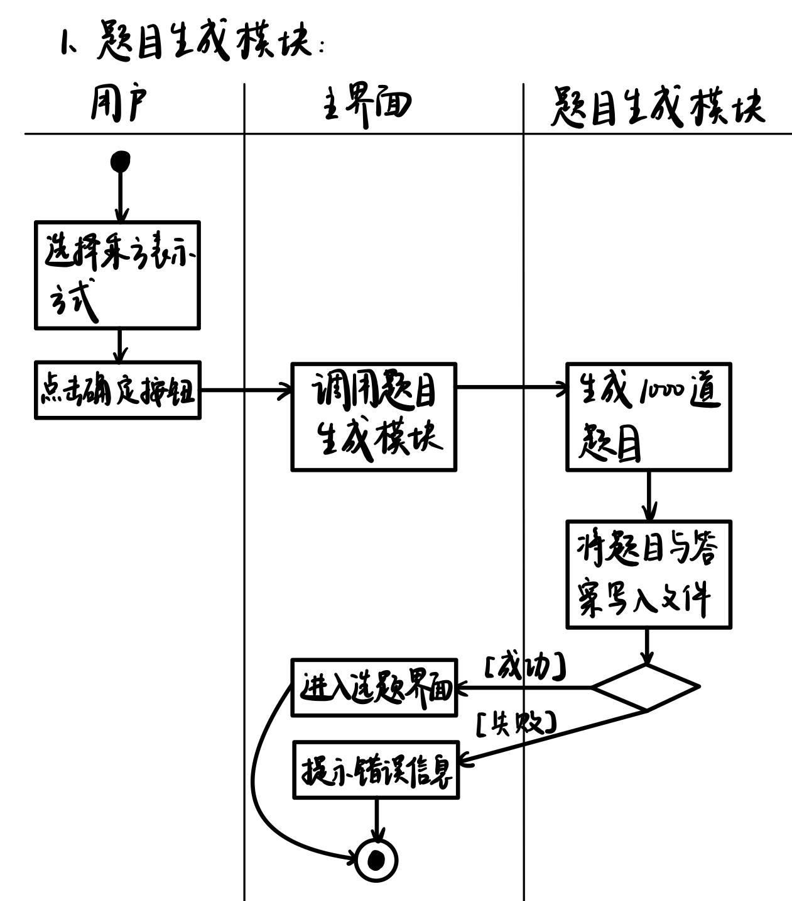
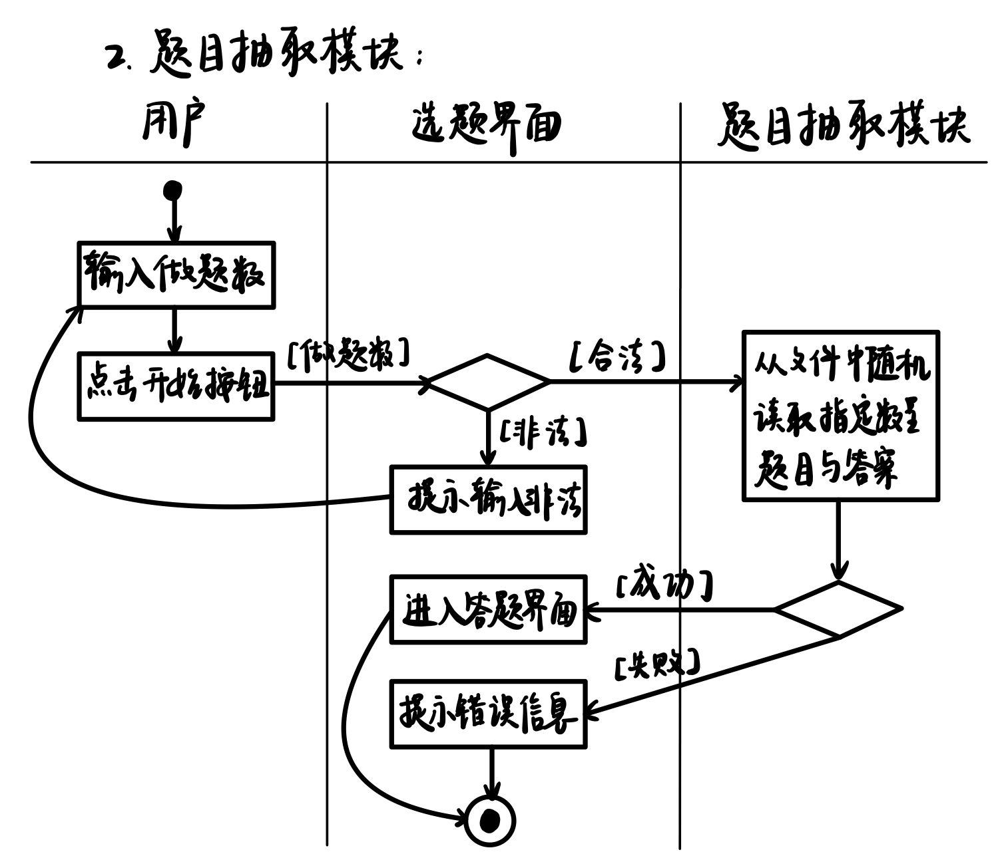
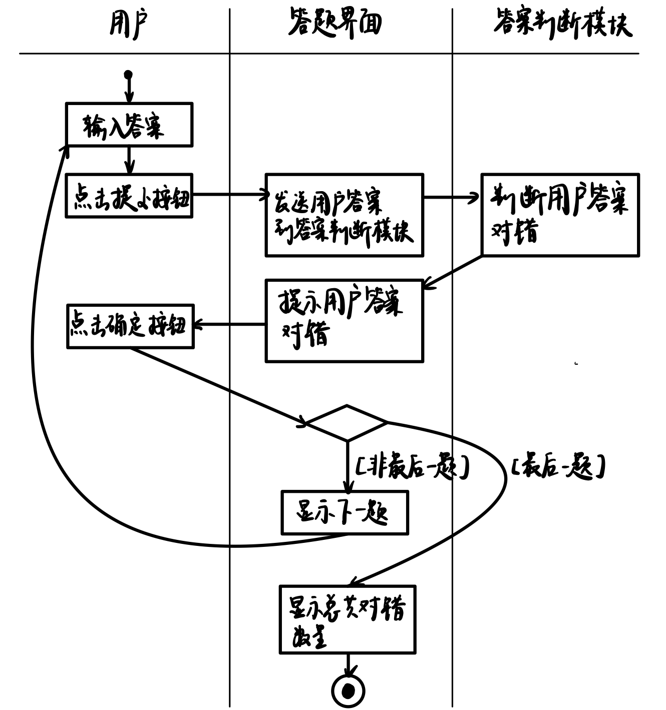

# 动态模型文档

## 1. 题目生成活动图

### 1.1 图形文档

### 1.2 活动图综述

题目生成活动图描述了生成题目的过程，涉及用户、主界面、题目生成模块三个对象，共同完成题目生成的过程。

### 1.3 参与者对象描述

“用户”是参与者，“主界面”和“题目生成模块”是两个对象。主界面负责传递用户与题目生成模块之间的消息。题目生成模块负责生成1000道不重复的题目，并将题目和答案写入文件。

### 1.4 状态描述

通过用户发出”选择乘方表示方式“和“点击确定按钮”的操作，主界面响应并调用题目生成模块生成题目，并写入文件，之后返回题目生成的结果至主界面。

### 1.5 转换描述

题目生成活动有一个分支控制，为选择结构。在将题目和答案写入文件后，若成功则主界面进入选题界面，若失败则主界面提示用户失败原因。

## 2. 题目抽取活动图

### 2.1 图形文档

### 2.2 活动图综述

题目抽取活动图描述了抽取题目的过程，涉及用户、选题界面、题目抽取模块3个对象，共同完成题目抽取的过程。

### 2.3 参与者对象描述

“用户”是参与者，“选题界面”和“题目抽取模块”是对象。选题模块负责传递用户与题目抽取模块之间的消息。题目抽取模块负责从题目文件中抽取出用户指定数量的题目。

### 2.4 状态描述

通过用户发出“输入做题数”和“点击开始按钮”的动作，选题界面响应并调用题目抽取模块抽取指定数量的题目与答案，返回题目抽取的结果至主界面。

### 2.5 转换描述

题目抽取活动有两个分支控制。一是循环结构，在用户点击开始按钮之后，选题界面对用户输入的合法性做检查，包括是否输入和选择、输入的题目数是否为1~1000的整数。若输入合法则调用题目抽取模块；若输入非法则返回至输入阶段重新输入，直到输入合法。二是选择结构，题目抽取模块从文件中读取后，判断读取结果，若读取成功则选题界面进入答题界面；若读取失败则提示用户失败原因。

## 3. 答案判断活动图

### 3.1 图形文档

### 3.2 活动图综述

答案判断活动图描述了判断答案的过程，涉及用户、答题界面和答案判断模块3个对象，共同完成判断答案的过程。

### 3.3 参与者对象描述

“用户”是参与者，“答题界面”和“答案判断模块”是两个对象。答题界面负责传递用户和答案判断模块之间的消息。答案判断模块负责判断用户输入的答案是否正确。

### 3.4 状态描述

通过用户发出“输入答案”和“点击提交按钮”动作，答题界面将用户输入发送到答案判断模块，答案判断模块将对错结果返回至答题界面，答题界面提示用户答案对错，用户点击确定按钮后进入下一题。用户答完所有题后，答题界面显示用户在本次答题中总共对错数量。

### 3.5 转换描述

答案判断模块有一个分支控制，为循环结构。用户得到本次答案，点击确定按钮后，判断当前是否为最后一题，若非最后一题则重复答题过程；若为最后一题则显示用户在本次答题中总共对错数量。

