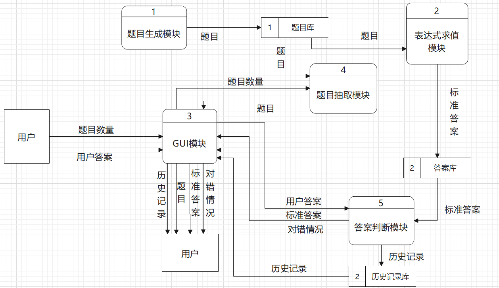

## 1 引言

### 1.1 编写目的

本文档为四则运算训练系统详细设计说明书，主要用于为实现系统的功能而进行的系统详细设计说明，在概要设计的基础上进一步明确系统结构，详细介绍系统各软件组成模块的实现流程、功能、接口等内容，便于对系统的编码进行指导和约束。本详细设计说明书的预期读者为本项目小组的成员、本项目的指导教师、以及有兴趣对该程序进行拓展和维护的人员。

### 1.2 项目背景

#### 1.2.1 项目名称

四则运算训练系统

#### 1.2.2 相关人员

* 项目开发者：邱睿桥，卜梦煜

* 项目用户：所有人

### 1.3 定义

1. MVC代表Model View Controller ，是模型 ( model )－视图 ( view )－控制器（Controller）的缩写。
2. 不加其他说明的情况下，本文档中“ll”表示“long long”数据类型。

### 1.4 参考资料

胡思康 编著，《软件工程基础》（第3版），清华大学出版社，2012.6。

## 2. 总体设计

### 2.1 需求概述

系统主要功能包括：

- 生成1000道不重复的四则运算题目并写入文件。
- 实现表达式求值功能，要求支持加、减、乘、除、乘方和括号运算。
- 支持真分数四则运算。
- 接收用户输入的答案，并判断对错。最后给出总共 对/错 数量。
- 系统可通过命令行参数的形式指定功能。
- 用windows用户图形界面实现上述功能。
- 图形界面具有倒计时功能，每个题目必须在 20 秒钟完成，如果完不成，则得0分并进入下一题。
- 图形界面具有历史记录查看功能，把用户做题的成绩记录下来并可以展现历史记录。

### 2.2 软件结构

本软件整体结构为MVC架构，设计图如下：

| 模块             | 名称              | 功能概述                                                   |
| ---------------- | ----------------- | ---------------------------------------------------------- |
| 题目生成模块     | ProblemGenerate   | 生成1000道不重复的四则运算题目，并将题目和答案存入题目文件 |
| 表达式求值模块   | CalculateFormula  | 输入表达式，计算表达式的值并返回                           |
| 题目抽取模块     | ProblemExtraction | 输入题目数量，从题目文件中读出指定数量的题目               |
| 答案判断模块     | AnswerJudge       | 输入用户答案，判断用户答案是否正确，并记录用户总共对错数量 |
| 历史记录管理模块 | ManageRecord      | 写入、读出、查询、清空用户历史记录，查询历史记录条数       |
| GUI模块          | GUI               | 负责与用户的交互，包括Cmd类与图形化界面                    |

## 3. Model部分程序描述

### 3.1 Number类

#### 3.1.1 总体功能

​	存储所有的运算数及运算结果。所有运算数都可以写为一个分数，其中整数看作分母为1的分数。

#### 3.1.2 属性设计

| 属性名      | 数据类型 | 作用                  |
| ----------- | -------- | --------------------- |
| nominator   | ll       | 存储分数分子          |
| denominator | ll       | 存储分数分母，且不为0 |

#### 3.1.3 函数设计

##### 3.1.3.1 Number()

| 函数名   | Number()                                                     |
| -------- | ------------------------------------------------------------ |
| 函数定义 | 1. Number(); 2. Number(ll nominator, ll denominator);    |
| 功能概要 | 构造函数，有两种形式： 1. 缺省构造函数，默认分数的值为0（分子0分母1） 2. 带参构造函数，指定分子分母 |
| 算法描述 | 1. 分别将nominator和denominator赋值为0和1 2. 赋值为传入的分子分母值 |
| 输入     | 1. 无输入 2. 输入分子分母值                              |
| 输出     | 无输出                                                       |

##### 3.1.3.2 getNominator()

| 函数名   | getNominator()     |
| -------- | ------------------ |
| 函数定义 | ll getNominator(); |
| 功能概要 | 获得分数的分子     |
| 算法描述 | 返回nominator      |
| 输入     | 无输入             |
| 输出     | 分子               |

获得分母函数方法类似。

##### 3.1.3.3 setNumber()

| 函数名   | setNumber()                                           |
| -------- | ----------------------------------------------------- |
| 函数定义 | void setNumber(ll nominator = 0, ll denominator = 1); |
| 功能概要 | 设置分数的分子分母值                                  |
| 算法描述 | 分别将nominator和denominator赋值为传入的分子分母值    |
| 输入     | 传入的分子分母                                        |
| 输出     | 无输出                                                |

##### 3.1.3.4 operator==()

| 函数名   | operator==()                                                 |
| -------- | ------------------------------------------------------------ |
| 函数定义 | bool operator==(const Number& num);                          |
| 功能概要 | 重载判断符，用于两个分数相等与否的判断                       |
| 算法描述 | 数1的分子*数2的分母==数1的分子 *数2的分母，返回真，否则为假。这样能判断两个未约分数的情况。 |
| 输入     | 被判断的分数                                                 |
| 输出     | 判断结果                                                     |

### 3.2 Node类

#### 3.2.1 总体功能

​	存储表达式树中的运算数结点或运算符结点。

#### 3.2.2 属性设计

| 属性名 | 数据类型       | 作用                             |
| ------ | -------------- | -------------------------------- |
| lchild | Node*          | 左孩子结点指针                   |
| rchild | Node*          | 右孩子结点指针                   |
| flag   | bool           | 标志结点类型，0表示数，1表示符号 |
| node   | union nodeData | 存储结点内容，数或符号           |

#### 3.2.3 函数设计

##### 3.2.3.1 Node()

| 函数名   | Node()                                                       |
| -------- | ------------------------------------------------------------ |
| 函数定义 | Node(); Node(bool flg);                                  |
| 功能概要 | 1. 缺省构造函数，初始化成员变量。默认该节点为数结点且数为0。 2. 指定结点类型的构造函数 |
| 算法描述 | 赋值即可，其中指针赋值为NULL                                 |
| 输入     | 1. 无输入 2. 输入节点类型                                |
| 输出     | 无输出                                                       |

##### 3.2.3.2 getData()

| 函数名   | getData()                              |
| -------- | -------------------------------------- |
| 函数定义 | union nodeData getData();              |
| 功能概要 | 获取结点内容，常与结点类型属性搭配使用 |
| 算法描述 | 返回结点内容即可                       |
| 输入     | 无输入                                 |
| 输出     | 结点内容                               |

获取结点类型类似。

##### 3.2.3.3 setData()

| 函数名   | setData()                                                    |
| -------- | ------------------------------------------------------------ |
| 函数定义 | 1. void setData(Number n);//设置结点的数 2. void setData(char ch);//设置结点的符号 |
| 功能概要 | 1. 设置结点的数 2. 设置结点的符号                       |
| 算法描述 | 赋值即可                                                     |
| 输入     | 分数或符号                                                   |
| 输出     | 无输出                                                       |

### 3.3 Calculator类

#### 3.3.1 总体功能

分数类的四则运算实现方法及约分方法。

第二阶段添加乘方运算方法。

#### 3.3.2 属性设计

无

#### 3.3.3 函数设计

##### 3.3.3.1 add()

| 函数名   | add()                                |
| -------- | ------------------------------------ |
| 函数定义 | Number add(Number num1,Number num2); |
| 功能概要 | 实现运算数加法                       |
| 算法描述 | 将运算数通分相加再约分得到结果       |
| 输入     | 两个运算数                           |
| 输出     | 运算结果                             |

减法、乘法、除法函数类似，注意除法需分母合法，否则打印错误信息。

##### 3.3.3.2 reduction()

| 函数名   | reduction()                                                  |
| -------- | ------------------------------------------------------------ |
| 函数定义 | Number reduction(Number n);                                  |
| 功能概要 | 约分                                                         |
| 算法描述 | 1. 用辗转相除法求得最大公约数 2. 分子分母分别除以最大公约数 |
| 输入     | 需要约分的分数                                               |
| 输出     | 约分后的分数                                                 |

##### 3.3.3.3 power()

| 函数名   | power()                                |
| -------- | -------------------------------------- |
| 函数定义 | Number power(Number num1,Number num2); |
| 功能概要 | 实现运算数乘方运算                     |
| 算法描述 | 用for循环实现乘方再约分得到结果        |
| 输入     | 两个运算数                             |
| 输出     | 运算结果                               |

### 3.4 Formula类

#### 3.4.1 总体功能

​	存储表达式的数据结构，定义表达式生成、查重、求值方法。

#### 3.4.2 属性设计

| 属性名         | 数据类型   | 作用                                  |
| -------------- | ---------- | ------------------------------------- |
| cal            | Calculater | 运算器                                |
| str            | string     | 中缀表达式                            |
| root           | Node*      | 表达式二叉树的根                      |
| value          | Number     | 存储表达式的值                        |
| int opNum      | int        | 表达式中符号的数量（不超过10）        |
| ll hash        | ll         | 表达式hash值                          |
| int numCnt[21] | int []     | 表达式中各数字的数量                  |
| int opCnt[5]   | int []     | 表达式中各符号的数量                  |
| bool powerFlag | bool       | 用户选择的乘方的表达形式，0为^，1为** |
| cnt            | static int | 用于随机数种子                        |

#### 3.4.3 函数设计

##### 3.4.3.1 generate()

| 函数名   | generate()                                                   |
| -------- | ------------------------------------------------------------ |
| 函数定义 | void generate(); void generate(bool flg);               |
| 功能概要 | 构造函数，有两种形式： 1. 缺省构造函数，默认乘方为^ 2. 带参构造函数，指定乘方为^或** 功能： 1. 初始化属性并重置随机种子 2. 用随机方法递归生成表达式二叉树 3. 计算hash值，判断生成的式子是否合法，合法则求中缀表达式和表达式值，否则重新生成 |
| 算法描述 | 1. 产生表达式二叉树根节点（一定产生符号），然后调用createChild()函数生成子树。 2. 分别调用calHash()、ToString()、calValue()函数计算hash值求中缀表达式和表达式值。 |
| 输入     | 无输入                                                       |
| 输出     | 无输出                                                       |

##### 3.4.3.2 createChild()

| 函数名   | createChild()                                                |
| -------- | ------------------------------------------------------------ |
| 函数定义 | Node* createChild();                                         |
| 功能概要 | 创建子树，用于递归建立二叉树                                 |
| 算法描述 | 1. 用随机数判断当前产生符号还是数，其中且总符号数>=10时一定产生数。 2. 若产生符号，则随机生成运算符，并递归调用自己继续随机生成左右子树结点。 3. 若产生数，则随机生成数，且结点为叶结点。 4. 规定乘方的左右子树（幂运算的指数底数）、除法右子树（分母）结点均为不为0的数结点。 |
| 输入     | 无输入                                                       |
| 输出     | 当前产生的结点指针                                           |

##### 3.4.3.3 ToString()

| 函数名   | ToString()                                                   |
| -------- | ------------------------------------------------------------ |
| 函数定义 | void ToString(Node* now);                                    |
| 功能概要 | 中序遍历当前节点。用于二叉树转中缀表达式，表达式存在属性str中。 |
| 算法描述 | 1. 递归遍历当前结点左子树。若左子树符号优先级更低，则应加上括号。 2. 遍历当前结点。其中乘方运算需判断写入形式。如果是乘方符号，需要由powerFlag的值判断相应表达形式。 3. 递归遍历当前节点右子树。若右子树符号优先级更低，则应加上括号。 |
| 输入     | 当前结点的指针                                               |
| 输出     | 无输出                                                       |

##### 3.4.3.4 calValue()

| 函数名   | calValue(Node* now);                                         |
| -------- | ------------------------------------------------------------ |
| 函数定义 | Number calValue(Node* now);                                  |
| 功能概要 | 计算以当前结点为根的表达式的值，用于计算表达式值             |
| 算法描述 | 1. 当前结点为数字时直接返回。 2. 当前结点为符号时，先递归调用自己计算左右子树的值，然后判断节点符号并进行相应运算。 |
| 输入     | 当前结点指针                                                 |
| 输出     | 计算结果                                                     |

##### 3.4.3.5 calHash()

| 函数名   | calHash()                                                    |
| -------- | ------------------------------------------------------------ |
| 函数定义 | void calHash();                                              |
| 功能概要 | 计算当前表达式的hash值，存在属性hash中                       |
| 算法描述 | 遍历所有运算数和符号，将它们及它们出现的次数均乘以71再加43后加到hash中 |
| 输入     | 无输入                                                       |
| 输出     | 无输出                                                       |

##### 3.4.3.6 deleteNode()

| 函数名   | deleteNode()                                               |
| -------- | ---------------------------------------------------------- |
| 函数定义 | void deleteNode(Node* now)                                 |
| 功能概要 | 删除当前结点及其所有子树结点，用于后序遍历删除表达式二叉树 |
| 算法描述 | 1. 递归调用自己删除左右子树 2. 删除自己               |
| 输入     | 当前结点                                                   |
| 输出     | 无输出                                                     |

### 3.5 File类

#### 3.5.1 总体功能

封装文件操作，提供读、写、删除文件，设置文件路径操作的接口。

#### 3.5.2 属性

| 属性名             | 数据类型            | 作用                     |
| ------------------ | ------------------- | ------------------------ |
| defaultProblemPath | static const string | 默认的题目文件路径       |
| defaultRecordPath  | static const string | 默认的历史记录文件路径   |
| problemPath        | string              | 题目文件路径             |
| recordPath         | string              | 历史记录文件路径         |
| fp                 | fstream             | 标准文件操作的文件流变量 |

#### 3.5.3 关键函数设计

##### 3.5.3.1 File()

| 函数名       | File()                                                       |
| ------------ | ------------------------------------------------------------ |
| **函数定义** | File();                                                      |
| **功能概要** | 构造函数，初始化文件路径为defaultProblemPath，检查文件是否正常 |
| **算法描述** | 初始化文件路径为defaultProblemPath，检查文件是否正常         |
| **输入**     | 无输入                                                       |
| **输出**     | 无输出                                                       |

##### 3.5.3.2 openFile()

| 函数名       | openFile()                                                   |
| ------------ | ------------------------------------------------------------ |
| **函数定义** | bool openFile(string path);                                  |
| **功能概要** | 私有方法，封装文件打开操作，并返回打开是否成功               |
| **算法描述** | 调用fstream::open()方法打开指定文件，操作方式为“可读写的二进制方式” |
| **输入**     | 无输入                                                       |
| **输出**     | 打开文件是否成功                                             |

##### 3.5.3.3 removeFile()

| 函数名       | removeFile()                       |
| ------------ | ---------------------------------- |
| **函数定义** | void removeFile(string path);      |
| **功能概要** | 删除现有文件                       |
| **算法描述** | 调用remove(string)方法删除指定文件 |
| **输入**     | 无输入                             |
| **输出**     | 无输出                             |

##### 3.5.3.4 writeToFile()

| 函数名       | writeToFile()                                            |
| ------------ | -------------------------------------------------------- |
| **函数定义** | void writeToFile(Formula* formula);                      |
| **功能概要** | 将表达式及答案写入题目文件                               |
| **算法描述** | 将表达式及答案写入题目文件，每行格式为“表达式 分子 分母” |
| **输入**     | formula：封装的表达式类                                  |
| **输出**     | 无输出                                                   |

##### 3.5.3.5 writeToFile()

| 函数名       | writeToFile()                        |
| ------------ | ------------------------------------ |
| **函数定义** | void writeToFile(string record);     |
| **功能概要** | 将历史记录写入历史记录文件           |
| **算法描述** | 打开文件，将历史记录写入历史记录文件 |
| **输入**     | 历史记录的内容                       |
| **输出**     | 无输出                               |

##### 3.5.3.6 readProblem()

| 函数名       | readProblem()                                                |
| ------------ | ------------------------------------------------------------ |
| **函数定义** | string readProblem(int num = 20);                            |
| **功能概要** | 从题目文件汇总随机读出num个表达式及答案                      |
| **算法描述** | 1. 调用generateRandom()方法随机生成num个1~1000的、不重复的随机数作为题号，存在临时数组ran中 2. 按照ran读出题目文件中的指定行 3. 将读出的题目拼接到字符串problems中，格式为“题目#题目#……” |
| **输入**     | num：抽取题目数量                                            |
| **输出**     | 抽取的题目problems                                           |

##### 3.5.3.7 readRecord()

| 函数名       | readRecord()                                                 |
| ------------ | ------------------------------------------------------------ |
| **函数定义** | string readRecord();                                         |
| **功能概要** | 从历史记录文件中读出所有历史记录                             |
| **算法描述** | 将读出的历史记录拼接到字符串records中，格式为“历史记录1#历史记录2#……” |
| **输入**     | 无输入                                                       |
| **输出**     | 读出的历史记录records                                        |

##### 3.5.3.8 setProblemPath()

| 函数名       | setProblemPath()                        |
| ------------ | --------------------------------------- |
| **函数定义** | void setProblemPath(string path);       |
| **功能概要** | 设置题目文件路径                        |
| **算法描述** | 通过对problemPath变量赋值，修改文件路径 |
| **输入**     | path：新的文件路径                      |
| **输出**     | 无输出                                  |

设置历史记录文件路径同理。

##### 3.5.3.9 generateRandom()

| 函数名       | generateRandom()                                             |
| ------------ | ------------------------------------------------------------ |
| **函数定义** | void generateRandom(int* ran, int num);                      |
| **功能概要** | 生成指定数量、非重复的随机数                                 |
| **算法描述** | 1. 调用stdlib库rand()方法生成num个1~1000的不重复的随机数，存在rand数组中 2. 对rand数组排序 |
| **输入**     | ran：存储随机数的数组 num：读出的题目个数               |
| **输出**     | 无输出                                                       |

## 4. Controller部分程序描述

### 4.1 ProblemGenerate类

#### 4.1.1 总体功能

生成1000道不重复的四则运算题目，并将题目和答案存入题目文件。

#### 4.1.2 属性

| 属性名       | 数据类型        | 作用                                        |
| ------------ | --------------- | ------------------------------------------- |
| file         | File*           | 利用File类进行将题目和答案写入文件的操作    |
| formula      | Formula*        | 利用Formula类进行四则运算题目生成、求值操作 |
| hashValueSet | static set\<ll> | 存储公式哈希值，用于查重                    |

#### 4.1.3 关键函数设计

##### 4.1.3.1 ProblemGenerate()

| 函数名       | ProblemGenerate()                                            |
| ------------ | ------------------------------------------------------------ |
| **函数定义** | ProblemGenerate();                                           |
| **功能概要** | 1. 构造函数，初始化成员变量 2. 调用generate()方法生成1000道题目 3. 将题目及答案写入题目文件 |
| **算法描述** | 1. 使用关键字new为file、formula动态分配内存 2. 调用generate()函数 |
| **输入**     | 无输入                                                       |
| **输出**     | 无输出                                                       |

##### 4.1.3.2 generate()

| 函数名       | generate()                                                   |
| ------------ | ------------------------------------------------------------ |
| **函数定义** | void generate();                                             |
| **功能概要** | 生成1000道不重复的题目并写入文件                             |
| **算法描述** | 1. 调用Formula::generate()方法生成题目 2. 利用hashValueSet查重。若不重复则调用File::writeToFile(Formula*)方法将生成的题目写入文件，并将该表达式的哈希值加入hsshValueSet；否则转步骤1重新生成表达式 3. 循环步骤1、2，生成1000道不重复的题目 |
| **输入**     | 无输入                                                       |
| **输出**     | 无输出                                                       |

### 4.2 ProblemExtraction类

#### 4.2.1 总体功能

随机抽取指定数量的题目及答案，并提供获取题目和答案的接口。

#### 4.2.2 属性

| 属性名   | 数据类型 | 作用                             |
| -------- | -------- | -------------------------------- |
| file     | File*    | 利用File类进行题目和答案读取操作 |
| problems | string   | 拼接表达式                       |
| answers  | string   | 拼接答案                         |
| num      | int      | 记录要抽取的题目数量             |

#### 4.2.3 关键函数设计

##### 4.2.3.1 ProblemExtraction()

| 函数名       | ProblemExtraction()        |
| ------------ | -------------------------- |
| **函数定义** | ProblemExtraction();       |
| **功能概要** | 初始化成员变量             |
| **算法描述** | 对变量赋初值或动态分配内存 |
| **输入**     | 无输入                     |
| **输出**     | 无输出                     |

##### 4.2.3.2 extract()

| 函数名       | extract()                                                    |
| ------------ | ------------------------------------------------------------ |
| **函数定义** | void extract(int num)                                        |
| **功能概要** | 从题目文件随机读出指定数量的题目                             |
| **算法描述** | 1. 调用File::readProblem(int num)方法读出指定数量的题目，存储在临时变量content 2. 解析content内容，将表达式与答案分别存在属性problems、answers中 3. 循环步骤2 num次 |
| **输入**     | num：希望抽取题目的数量                                      |
| **输出**     | 无输出                                                       |

##### 4.2.3.3 getProblem()

| 函数名       | getProblem()         |
| ------------ | -------------------- |
| **函数定义** | string getProblem(); |
| **功能概要** | 返回私有变量problems |
| **算法描述** | 返回私有变量problems |
| **输入**     | 无输入               |
| **输出**     | 私有变量problems     |

### 4.3 AnswerJudge类

#### 4.3.1 总体功能

对用户输入的答案判断对错并返回，记录用户答题对错总数。

#### 4.3.2 属性

| 属性名         | 数据类型 | 作用                   |
| -------------- | -------- | ---------------------- |
| standardAnswer | Number*  | 存储标准答案           |
| num            | int      | 题目总数               |
| right          | int      | 用户回答正确的题目数量 |

#### 4.3.3 函数设计

##### 4.3.3.1 AnswerJudge()

| 函数名       | AnswerJudge()              |
| ------------ | -------------------------- |
| **函数定义** | AnswerJudge();             |
| **功能概要** | 初始化成员变量             |
| **算法描述** | 对变量赋初值或动态分配内存 |
| **输入**     | 无输入                     |
| **输出**     | 无输出                     |

##### 4.3.3.2 readAnswer()

| 函数名       | readAnswer()                                                 |
| ------------ | ------------------------------------------------------------ |
| **函数定义** | void readAnswer(ProblemExtraction* pe);                      |
| **功能概要** | 获取抽取的题目的答案                                         |
| **算法描述** | 1. 调用ProblemExtraction::getAnswer()方法读取题目答案，存在string类型变量中 2. 解析该字符串，将题目答案转化成Number类型，并存储在standardAnswer中 |
| **输入**     | pe：用于题目抽取的ProblemExtraction对象的指针                |
| **输出**     | 无输出                                                       |

##### 4.3.3.3 judgeAnswer()

| 函数名       | judgeAnswer()                                                |
| ------------ | ------------------------------------------------------------ |
| **函数定义** | bool judgeAnswer(int k, Number& answer);                     |
| **功能概要** | 输入用户答案，判断对错并返回                                 |
| **算法描述** | 1. 调用Number::operator==判断用户输入的答案是否等于standardAnswer[k] 2. 通过right变量记录正确题目数量 |
| **输入**     | k：题号 answer：用户答案                                |
| **输出**     | 用户输入对错，true表示正确，false表示错误                    |

##### 4.3.3.4 getResult()

| 函数名       | getResult()          |
| ------------ | -------------------- |
| **函数定义** | int getResult();     |
| **功能概要** | 返回用户答题正确数量 |
| **算法描述** | 返回用户答题正确数量 |
| **输入**     | 无输入               |
| **输出**     | 用户答题正确数量     |

### 4.4 ManageRecord类

#### 4.4.1 总体功能

管理用户的答题历史记录。

#### 4.4.2 属性

| 属性名       | 数据类型         | 作用                                           |
| ------------ | ---------------- | ---------------------------------------------- |
| file         | File*            | 文件指针，指向历史记录文件                     |
| num          | int              | 历史记录数量                                   |
| record       | string []        | 历史记录内容数组，一条历史记录为数组中一个元素 |
| maxRecordNum | static const int | 缓存的最大历史记录数量                         |

#### 4.4.3 函数设计

##### 4.4.3.1 writeRecord()

| 函数名       | writeRecord()                                                |
| ------------ | ------------------------------------------------------------ |
| **函数定义** | void writeRecord(int correct, int sum);                      |
| **功能概要** | 当输入参数合法时，将本次答题时间、答题正确情况写入历史记录文件；否则给出错误提示。 |
| **算法描述** | 打开文件，将历史记录写入文件尾。                             |
| **输入**     | 本次作答的正确数量、本次答题总数                             |
| **输出**     | 无输出                                                       |

##### 4.4.3.2 readRecord()

| 函数名       | readRecord()                                             |
| ------------ | -------------------------------------------------------- |
| **函数定义** | void readRecord();                                       |
| **功能概要** | 将历史记录文件的所有历史记录写入record属性中，便于查阅。 |
| **算法描述** | 打开文件，将历史记录读出。                               |
| **输入**     | 无输入                                                   |
| **输出**     | 无输出                                                   |

##### 4.4.3.1 getRecord()

| 函数名       | getRecord()                        |
| ------------ | ---------------------------------- |
| **函数定义** | string getRecord(int i);           |
| **功能概要** | 获取第i条历史记录                  |
| **算法描述** | 若i合法，则返回第i条历史记录内容。 |
| **输入**     | 要查阅的历史记录编号               |
| **输出**     | 无输出                             |

## 5. View

### 5.1 cmd类

#### 5.1.1 总体功能

负责与用户交互，解析、运行用户输入的命令行指令。

#### 5.1.2 属性

| 属性名  | 数据类型 | 作用                   |
| ------- | -------- | ---------------------- |
| argv    | string[] | 存储解析后的命令行参数 |
| num     | int      | 命令行参数个数         |
| correct | int      | 用户正答数量           |

#### 5.1.3 函数设计

##### 5.1.3.1 parse()

| 函数名       | parse()                                            |
| ------------ | -------------------------------------------------- |
| **函数定义** | int parse(string cmd);                             |
| **功能概要** | 解析命令行输入，分解为参数存入argv，并记录参数个数 |
| **算法描述** | 将cmd按空格分割成若干参数存入argv，最多接受2个参数 |
| **输入**     | cmd：用户输入命令行的内容                          |
| **输出**     | 运行的状态，用于控制程序执行顺序                   |

##### 5.1.3.2 clear()

| 函数名       | clear()                 |
| ------------ | ----------------------- |
| **函数定义** | void clear();           |
| **功能概要** | 清空命令行参数          |
| **算法描述** | 对私有变量argv、num赋值 |
| **输入**     | 无输入                  |
| **输出**     | 无输出                  |

##### 5.1.3.3 func()

| 函数名       | func()                                                       |
| ------------ | ------------------------------------------------------------ |
| **函数定义** | int func(int argc, string* argv);                            |
| **功能概要** | 解析命令行参数，执行对应的命令行指令，并返回运行状态         |
| **算法描述** | 判断argv的参数，对于符合命令行约定的指令予以执行，否则认为参数错误 |
| **输入**     | argc：命令行参数个数 argv：命令行参数                   |
| **输出**     | 运行的状态，用于控制程序执行顺序                             |

##### 5.1.3.4 problemGenerate()

| 函数名       | problemGenerate()                                 |
| ------------ | ------------------------------------------------- |
| **函数定义** | int problemGenerate();                            |
| **功能概要** | 生成1000道不重复的四则运算题目                    |
| **算法描述** | 调用Controller中ProblemGenerate类生成四则运算题目 |
| **输入**     | 无输入                                            |
| **输出**     | 无输出                                            |

##### 5.1.3.5 problemExtraction()

| 函数名       | problemExtraction()                                          |
| ------------ | ------------------------------------------------------------ |
| **函数定义** | int problemExtraction(int num);                              |
| **功能概要** | 抽取num道不重复的四则运算题目                                |
| **算法描述** | 调用Controller中ProblemExtraction类抽取num道不重复的四则运算题目 |
| **输入**     | num：抽取的四则运算题目数量                                  |
| **输出**     | 无输出                                                       |

##### 5.1.3.6 answerJudge()

| 函数名       | answerJudge()                                                |
| ------------ | ------------------------------------------------------------ |
| **函数定义** | bool answerJudge(int num, string answer);                    |
| **功能概要** | 判断用户答案是否正确                                         |
| **算法描述** | 解析用户输入的答案，调用Controller中AnswerJudge类判断用户答案是否正确 |
| **输入**     | num：题号 answer：用户输入的初始答案                    |
| **输出**     | 用户输入是否正确                                             |

##### 5.1.3.7 answer()

| 函数名       | answer()                                                     |
| ------------ | ------------------------------------------------------------ |
| **函数定义** | int answer();                                                |
| **功能概要** | 与用户进行答题交互                                           |
| **算法描述** | 与用户进行答题交互，接受用户输入的答案，返回用户答题对错情况 |
| **输入**     | 无输入                                                       |
| **输出**     | 无输出                                                       |

##### 5.1.3.8 isNum()

| 函数名       | isNum()                                    |
| ------------ | ------------------------------------------ |
| **函数定义** | bool isNum(string str);                    |
| **功能概要** | 判断字符串是否为整数                       |
| **算法描述** | 通过逐字符判断的形式，判断字符串是否为整数 |
| **输入**     | 字符串                                     |
| **输出**     | 该字符串是否为整数                         |

### 5.2 Mainwindow类

#### 5.2.1 总体功能

呈现qt图形界面，负责与用户交互。

#### 5.2.2 属性

这里只列出除了控件和与controller部分的类进行组合之外的属性。

| 属性名   | 数据类型 | 作用             |
| -------- | -------- | ---------------- |
| num      | int      | 本次答题总数     |
| answered | int      | 本次已经答题数量 |
| correct  | int      | 本次正答数量     |
| count    | int      | 倒计时秒数       |

#### 5.2.3 函数设计

##### 5.2.3.1 ShowStartInfo()

| 函数名       | ShowStartInfo()                                              |
| ------------ | ------------------------------------------------------------ |
| **函数定义** | void ShowStartInfo();                                        |
| **功能概要** | “选择”按钮(选择乘方表达形式)和“返回”按钮的槽函数，显示初始界面，引导用户输入答题数量来进行答题 |
| **算法描述** | 初始化属性，更新控件                                         |
| **输入**     | 无输入                                                       |
| **输出**     | 无输出                                                       |

##### 5.2.3.2 ShowFirstQuestion()

| 函数名       | ShowFirstQuestion()                                          |
| ------------ | ------------------------------------------------------------ |
| **函数定义** | void ShowFirstQuestion();                                    |
| **功能概要** | “开始答题”按钮的槽函数，判断用户输入做题数量，若不合法则给出提示，若合法则显示第一道题，并开始倒计时。 |
| **算法描述** | 判断输入框是否为整数；抽取题目，读取答案；更新控件           |
| **输入**     | 无输入                                                       |
| **输出**     | 无输出                                                       |

##### 5.2.3.3 ShowAnswer()

| 函数名       | ShowAnswer()                                                 |
| ------------ | ------------------------------------------------------------ |
| **函数定义** | void ShowAnswer();                                           |
| **功能概要** | “提交”按钮的槽函数，判断用户是否作答，若作答则给出答案并结束倒计时，否则给出提示。 |
| **算法描述** | 判断输入框是否为空，调用答案判断模块判断答案，更新控件       |
| **输入**     | 无输入                                                       |
| **输出**     | 无输出                                                       |

##### 5.2.3.4 ShowNextQuestion()

| 函数名       | ShowNextQuestion()                               |
| ------------ | ------------------------------------------------ |
| **函数定义** | void ShowNextQuestion();                         |
| **功能概要** | “下一题”按钮的槽函数，进入下一题，并开始倒计时。 |
| **算法描述** | 并更新相应控件                                   |
| **输入**     | 无输入                                           |
| **输出**     | 无输出                                           |

##### 5.2.3.5 ShowHistory()

| 函数名       | ShowHistory()                                                |
| ------------ | ------------------------------------------------------------ |
| **函数定义** | void ShowHistory();                                          |
| **功能概要** | “查看/关闭历史记录”按钮的槽函数。若历史记录控件隐藏，则打开它并显示“清除”按钮；若显示，则关闭它并隐藏“清除”按钮。 |
| **算法描述** | 更新相应控件                                                 |
| **输入**     | 无输入                                                       |
| **输出**     | 无输出                                                       |

##### 5.2.3.6 ClearHistory()

| 函数名       | ClearHistory()                                               |
| ------------ | ------------------------------------------------------------ |
| **函数定义** | void ClearHistory();                                         |
| **功能概要** | “清除”按钮的槽函数。清除历史记录。                           |
| **算法描述** | 调用历史记录管理类清除历史记录，并清除GUI中历史记录控件的内容。 |
| **输入**     | 无输入                                                       |
| **输出**     | 无输出                                                       |

##### 5.2.3.7 Timer()

| 函数名       | Timer()                                                      |
| ------------ | ------------------------------------------------------------ |
| **函数定义** | void Timer();                                                |
| **功能概要** | “开始答题”和“下一题”按钮的槽函数。在每次开始答题同时进行倒计时。 |
| **算法描述** | 重置倒计时时间，新建计时器进行倒计时并显示。                 |
| **输入**     | 无输入                                                       |
| **输出**     | 无输出                                                       |

##### 5.2.3.8 timerEvent()

| 函数名       | timerEvent()                                                 |
| ------------ | ------------------------------------------------------------ |
| **函数定义** | void timerEvent(QTimerEvent* event);                         |
| **功能概要** | 重写时间事件函数，结合计时器进行倒计时。                     |
| **算法描述** | 当时间事件id等于当前计时器id时将倒计时时间-1，从而实现定时倒计时功能。 |
| **输入**     | Qt的时间事件                                                 |
| **输出**     | 无输出                                                       |

##### 5.2.3.9 ShowResult()

| 函数名       | ShowResult()                                                 |
| ------------ | ------------------------------------------------------------ |
| **函数定义** | void ShowResult();                                           |
| **功能概要** | “结束”按钮的槽函数，显作答结果(答题数量、正确情况)并写入历史记录。 |
| **算法描述** | 写入文件，并更新相应控件                                     |
| **输入**     | 无输入                                                       |
| **输出**     | 无输出                                                       |
