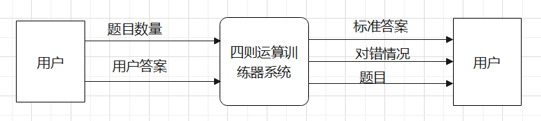
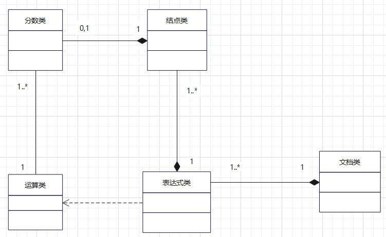

# 需求规格说明文档

## 1.范围

### 1.1 标识

系统名称：四则运算训练器系统。

### 1.2 系统概述

四则运算训练器系统，用于自动生成四则运算题目，并对用户输入的答案判断对错。

### 1.3 文档概述

版本1.0.0.2：

新增“支持乘方运算”的需求。

版本1.0.0.1：

本文档详细阐述四则运算训练器系统的各个模块的数据、界面、用户操作等功能需求，以及系统安全性、稳定性、鲁棒性等非功能需求。

### 1.4 基线

四则运算训练器系统设计依据“用户需求-四则运算训练器系统-用户体验-设计优化”这条准线进行分析、设计、实现、测试、维护。

## 2.引用文件

胡思康 编著，《软件工程基础》（第3版），清华大学出版社，2012.6。

## 3.需求

### 3.1 需求概述

#### 3.1.1  目标

系统主要功能包括：

- 生成1000道不重复的四则运算题目并写入文件。
- 实现表达式求值功能，要求支持加、减、乘、除、乘方和括号运算。
- 支持真分数四则运算。
- 接收用户输入的答案，并判断对错。最后给出总共 对/错 数量。
- 系统可通过命令行参数的形式指定功能。

#### 3.1.2  运行环境

本系统运行环境为Windows 10及以上版本，对硬件系统无要求。

#### 3.1.3  用户的特点

本系统适合初学四则运算，并希望练习四则运算的人员，使用人员有基础的计算机知识和计算机硬件条件即可。

#### 3.1.4  关键点

本系统的关键点在于随机生成四则运算题目，并对用户输入的答案判断对错。

系统关键模块如下：

- 题目生成模块：系统随机生成1000道四则运算题目。
- 表达式求值模块：对输入的四则运算表达式求值。其中乘方运算要求支持“^” 和“**”两种格式。
- 题目抽取模块：为用户随机抽取指定数量的四则运算题目。
- 用户答案判断模块：查询答案库，对用户输入的答案判断对错。
- GUI模块：与用户交互，根据用户操作，调用题目生成模块生成四则运算题目，并存在题库文件中；调用题目抽取模块获取指定数量的题目，并显示；调用用户答案判断模块对用户输入的答案判断对错，并显示总共 对/错 数量。

#### 3.1.5  约束条件

本系统约束条件如下：

1. 生成的四则运算表达式最多10个运算符，括号的数量不限制。

### 3.2 需求规格

#### 3.2.1  软件系统总体功能/对象结构

顶层数据流图（功能结构）：

类图（对象结构）：

#### 3.2.2  软件子系统功能/对象结构

一层数据流图：

### 3.3 软件配置项能力需求

基本功能需求：

- 四则运算表达式生成和查重。
- 将表达式保存在文件中。
- 题目抽取。
- 判断用户答案正误。
- 统计用户答案对/错数量。
- GUI显示系统：
  * 安全性需求：题目及答案文档不能被随意更改，用户在提交前不能查看答案。
  * 稳定性需求：系统在任何网络环境下都能正确运行；计算机硬件等外部环境发生变化不影响系统运行。
  * 鲁棒性需求：对于用户的非法操作（如非法输入）、计算过程中的数据溢出等特殊情况能够进行及时响应和正确处理。

### 3.4 软件配置项的外部接口需求

用户接口：GUI和命令行。

### 3.5 软件配置项内部接口需求

- 表达式生成模块：表达式id、表达式字符串。
- 表达式求值模块：表达式id、表达式的值。
- 题目抽取模块：题目id、表达式字符串、表达式的值。
- 用户答案判断模块：用户答案、用户答案正误情况、用户答题正误数量。
- GUI界面模块：表达式字符串、按钮、用户答案正误情况、用户答题正误数量。

### 3.6 软件配置项内部数据需求

表达式字符串、表达式逆波兰表示（二叉树方法表示）。

### 3.7 软件配置项的环境需求

64-bit Windows 10。

### 3.8 计算机资源需求

#### 3.8.1  计算机软件需求

操作系统windows 10。

### 3.9 软件质量因素

- 功能性：每次运行程序时能自动产生1000到四则运算题目；能接受用户输入答案并判定对错，最后给出总共对/错的数量；最多支持10个运算符。
- 可靠性：一次产生1000题且重复率为0；错误判定用户输入法答案正确性次数为0。
- 可维护性：若有需求扩展，扩展需求的实现应控制在3天内，且对初代软件功能影响为0。
- 可用性：刚运行程序初始化时，产生所有题目所用时间不能超过2秒，保证用户输入后能及时得到题目反馈。
- 可测试性：能根据至少10个测试用例确保程序能够正确处理各种情况。

### 3.10  设计和实现的约束

设计与实现时采用面向对象方法，并且严格按照需求规格说明中实现。

### 3.11  数据

- 系统输入：
  * 命令行形式：用户通过命令行输入本次做题的数量（≤1000）、做题答案。
  * GUI形式：用户在界面输入本次做题的数量（≤1000）、做题答案；点击按钮执行开始做题、查看答案、下一题、结束作答等操作。
- 系统输出：产生的四则运算公式、用户答案的对错情况及正确答案、用户总正确率。
- 数据管理：能够处理溢出数据和用户输入的错误数据。

### 3.12  操作

- 常规操作：用户输入或点击界面后，系统应立即做出相应应答。
- 初始化操作：用户运行程序时，自动产生1000道四则运算题；界面初始化。

### 3.13  故障处理

出现故障（如电脑死机、用户输入非法数据或数据溢出等）时，系统应及时提示错误类型指引用户操作，严重时应当关闭程序。

### 3.14  算法说明

产生四则运算题目用生成二叉树的方法。

### 3.15  有关人员的需求

小组成员应当熟练掌握c++语言和VS、Qt等开发软件。

### 3.16  有关培训的需求

小组成员自行学习相关内容。

### 3.17  需求的优先次序和关键程度

功能需求优先级最高，其次是性能需求。